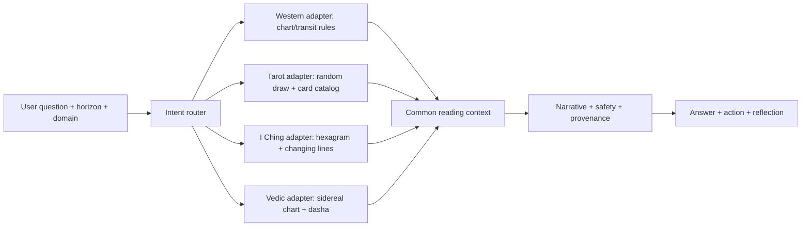
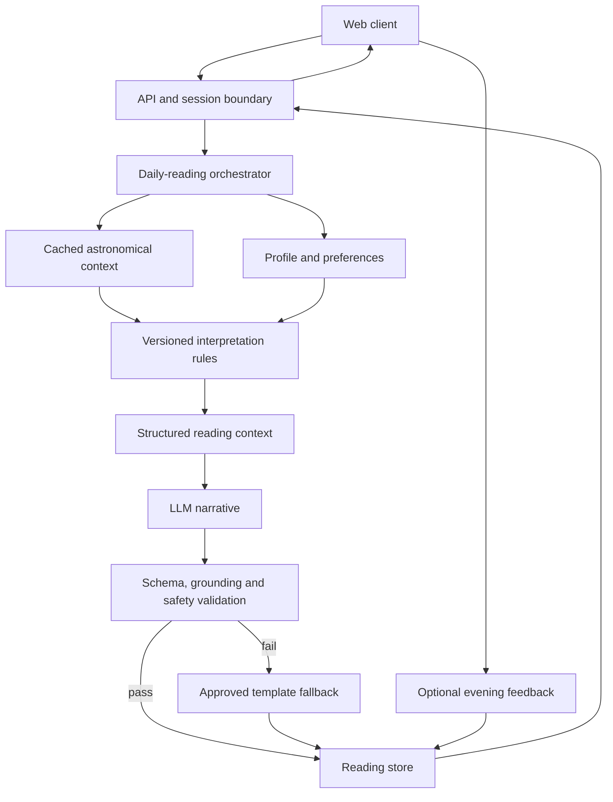
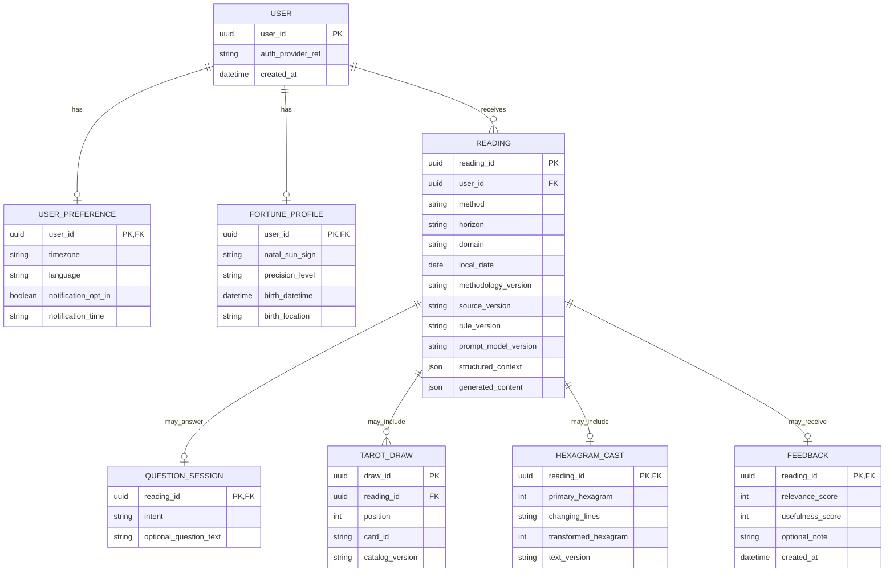

# Assignment 4 — Daily Compass

**Design proposal (1 October 2026).** The [official brief](../assignment-brief/Forward%20Deployed%20AI-Eng%20Assignment%202026.pdf) asks for an AI daily fortune system but specifies neither platform nor method. Daily Compass is a responsive web experience for adults who enjoy short, low-risk daily reflection. Its astrology-inspired and card-based interpretations are entertainment, not scientifically validated predictions.

**Core loop:** Signal → Why → Action → Reflection. Show a theme, the source signals and rule behind it, one optional small action, and an evening check-in. “Why” describes inputs and rules, not model chain-of-thought.

The expanded product answers **today, week, month and year** questions across **love, career, study and money**, plus direct questions such as “Will I get this job?” and “Will my ex return?” The [intent router](INTENT_ROUTER.md) selects a suitable method and answer format. The [method framework](METHOD_SELECTION.md) ranks methods by product fit and implementation burden, never predictive accuracy. [Question examples](QUESTION_CATALOG.md) show calibrated, concrete responses.

## 4.1 Features

| Priority | Feature | Purpose |
|---|---|---|
| POC | General daily reading or optional local Sun-sign context | Let users try without identity; keep only the derived sign in this browser. |
| POC | Daily Compass card | One short, stable reading per local day. |
| POC | Ask with Tarot: career, relationship or one-card spread | Give an interactive answer to a specific question with a visible random draw and fixed card meanings. |
| POC | Why this reading? | Explain calculated context, selected rule and profile precision. |
| POC | One safe action | Turn a theme into an optional, reversible action. |
| POC | Evening reflection | Collect relevance/usefulness and an optional private note. |
| MVP | Birth chart, daily/weekly/monthly/yearly scopes and love/career/study/money filters | Provide selected long- and short-horizon readings from precise profile data and reviewed rules. |
| MVP | 78-card Tarot catalog and I Ching decision mode | Expand question formats after validating the POC. |
| Production | History, language/timezone preferences, opt-in reminder | Support repeat use and user control. |
| Experimental system API | Vedic timing | Prototype sidereal Moon/nakshatra and Vimshottari major periods; withhold user-facing launch until specialist validation. |

Guest mode receives a general theme. The POC may ask users for **birth date only** to derive an approximate natal Sun sign in the browser, then discards the date; it does not claim a full chart. Exact birth time and place are not requested in the POC. A later registered/full-chart method needs separate consent, precision handling and a feature justification.

**Method roles:** Western astrology supplies profile and sampled time-horizon themes; Tarot handles question-specific situations; I Ching frames decisions and change; the experimental Vedic endpoint exposes traditional long-horizon timing structure. A proposed “lucky color,” conflict-avoidance prompt, or harmless remedy is labeled as a cultural/reflective ritual, not a mechanism that changes luck. A deity question receives respectful belief exploration with the user's tradition and consent, never a claim that a deity is objectively assigned or that worship guarantees life improvement.

## 4.2 Market positioning

| Product | Observed offering from official source | Daily Compass emphasis |
|---|---|---|
| [Co–Star](https://www.costarastrology.com/faq/) | Birth date/time/place, personalized astrology and friend compatibility; the company describes astronomical data with human and AI interpretation. | Plain-language source/rule explanation plus a same-day usefulness check. |
| [CHANI](https://www.chani.com/app) | Daily horoscopes, personalized transits, meditations, a journal and reflection prompts; it says astrologers write its content. | Put signal, explanation, one action and same-day reflection in a compact reading flow. |
| [Faladdin](https://www.faladdin.com/support/en) | Personalized fortune readings including submitted coffee-cup photos; its [terms](https://www.faladdin.com/eula) list multiple methods. | Focus initially on one daily ritual and explicit source-level explanation. |

Official pages checked **1 October 2026**. This describes published capabilities, not a complete product audit. The proposed differentiation is the **combination and emphasis** of explanation, action and feedback in one daily flow. It is a hypothesis to test, not a claim of superior accuracy or that competitors lack reflection.

## 4.3 Technical blueprint

The multi-method design adds `Intent Router → Method Adapter` before source calculation/draw. Routing uses explicit user choices first; later AI classification may suggest a mode with user override. Each adapter returns a common evidence envelope: method, horizon, domain, source IDs, rule/catalog version, interpretation, limitations and allowed actions. The narrative layer cannot invent a different method result.

The POC includes daily-lite and sampled-horizon Western themes, Western tropical natal calculations, Tarot question readings, I Ching coin-cast plus King Wen identity, and an experimental Vedic timing endpoint. I Ching classical line text remains future work. The daily request path below is the implemented Western-lite case.

1. **Astronomical calculation:** use a pinned local ephemeris and calculation library for dated positions. [JPL Horizons](https://ssd.jpl.nasa.gov/horizons/manual.html) can independently check positions; it does not validate astrology. [Skyfield](https://github.com/skyfielders/python-skyfield) is a POC candidate with an [MIT license](https://github.com/skyfielders/python-skyfield/blob/master/LICENSE). Check coordinate conventions, kernel coverage and data-file rights before implementation.
2. **Interpretation:** a documented, versioned astrology-inspired rule maps positions and available profile precision to theme, supporting signal IDs and allowed action categories. Meanings are product rules, not scientific facts.
3. **LLM:** receives only validated context, language and tone. It returns `signal`, `reading`, `why`, `action` and `reflection_prompt`. It cannot add positions, rule outcomes or unsupported personal claims.
4. **Validator:** checks schema, lengths, source/rule grounding and prohibited high-stakes or fatalistic content. One bounded retry, then a curated fallback; unsafe drafts are never shown.
5. **Consistency:** unique `(subject_id, local_date, methodology_version)` reading. Reuse the first successful result. Timezone changes apply on the next reading day. Store calculator/kernel, rule, prompt and model versions.

The current POC is one local web service plus browser storage, with on-demand generation. A production registered product can add a relational database, shared precomputed context, jobs and opt-in notifications as volume requires. If calculation data is unavailable, use verified cached context or fail gracefully; never invent sky positions. If the LLM fails, use approved static wording. Notification failure does not erase the reading. Log IDs, versions, latency and errors without reflection text.

## 4.4 Data and ER diagram

**Yes, for registered users who choose personalization/history.** Guests can receive an unlinked general reading without a persistent account. Free-text question and reflection are optional and private by default. Precise birth date, time and location would be collected only for a full chart feature; the POC does not store them. Religion/deity preference is not inferred or stored by default.

| Data | Purpose | Need and sensitivity |
|---|---|---|
| Account ID, auth-provider reference | Sign-in and sync | Registered only; personal. |
| Birth date or derived Sun sign | Approximate Sun-sign interpretation | Optional; store derived sign if exact date is no longer needed. |
| Timezone, language | Correct local day and display | Timezone needed; language can default. |
| Notification opt-in/time | Reminders | Production only, explicit opt-in. |
| Date, source/rule IDs, content and versions | Stable result, history and audit | Registered only; personal. |
| Scores and optional note | Reflection and evaluation | Optional; note may be sensitive. |
| Selected method, horizon, domain, rule/source IDs | Route and reproduce a reading | Per reading; low to personal. |
| Optional question text and Tarot draw/hexagram result | Answer and replay a consented question reading | Sensitive text; allow ephemeral mode and deletion. |
| Exact birth time/place, if full chart enabled | Calculate precise chart/houses and timezone | Optional, sensitive; collect only for that mode. |

No contacts, live GPS, health or financial records, or private messages. Restrict access, encrypt sensitive data, offer deletion of reading/note/account, and set retention periods with a product/privacy owner before launch. Do not claim legal compliance from this design alone.

A registered profile remains optional because Tarot and I Ching need no birth data. A `READING` has one method/horizon/domain, and only the method-specific result that applies. `FEEDBACK` is 0..1 per reading; a daily reading is unique per user/local date/method version, while question readings can be repeated. Guest responses are ephemeral and excluded from this registered-user ERD. [ERD.md](ERD.md) gives the storage and deletion rules. Method catalogs are application configuration, not user data.

## 4.5 KPIs

**North star:** weekly returning Compass users = distinct users who complete a reading in one week and another in the next. Track guest sessions separately because cross-device identity is unknown. Do not optimize fear-driven engagement or time spent.

| Dimension | Proposed measure |
|---|---|
| Activation | First-reading completion; time to displayed card. |
| Retention | D1/D7/D30 returns by first-reading cohort, split guest/registered. |
| Engagement | Completion, Why expansion, action save, evening reflection completion. |
| User value | Relevance/usefulness distributions and response rate to show selection bias. |
| AI quality | Structured-output validity, supported-signal rate, sampled unsupported-claim rate, fallback rate. |
| Safety | High-stakes violation rate on fixed eval set, blocked outputs, user reports. |
| Reliability | Reading success, API errors, P50/P95 latency, job/notification failures. |
| Cost | AI cost per completed reading, compute cost per active user, context-cache hit rate. |

No baseline, targets or improvements are claimed. Use safety and reliability as release gates; gather a pilot baseline before setting targets. “It came true” is subjective feedback, not scientific accuracy.

Segment these measures by method, time horizon and domain. Add **intent-to-answer completion**, **question answered rating**, **draw completion**, and **method override rate** to learn whether routing is useful. Never optimize “prediction accuracy” from subjective votes as if objective outcomes were known.

## POC and production

The [working POC](poc/README.md) demonstrates daily/period theme generation, a stateless question API, Tarot draws from a 78-card compositional catalog, Western tropical natal placements/angles/Whole Sign houses/major aspects, I Ching line casting with King Wen hexagram identity, and an experimental Vedic timing endpoint. The responsive website now uses these system APIs for period/topic readings, Ask Oracle, Tarot, I Ching, Western chart and Vedic timing screens. It uses `astronomy-engine@2.1.19` for local source calculation. Optional OpenAI structured output rephrases the original daily reading only; the live call remains unverified without an API key. Tarot question text is not persisted or returned in API responses. There is no server-side user-data store. Playwright captures the current desktop flows and checks mobile layout. Remaining work includes natal chart comparison against independent fixtures, specialist validation of Vedic conventions, editorial review of Tarot meanings, I Ching line-text interpretation and full Thai/English coverage. Production adds authentication, encrypted storage, deletion, monitoring, scheduled jobs, cost limits and controlled prompt/rule releases.

**Why AI?** To write clear text in a chosen language and tone. **Why separate layers?** Positions, meanings and wording have different sources and failure modes. **What does Why show?** Source/rule factors only. **What remains unproven?** Whether users prefer and return for the loop; validate through interviews and a pilot.
