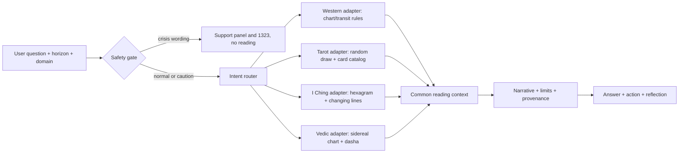
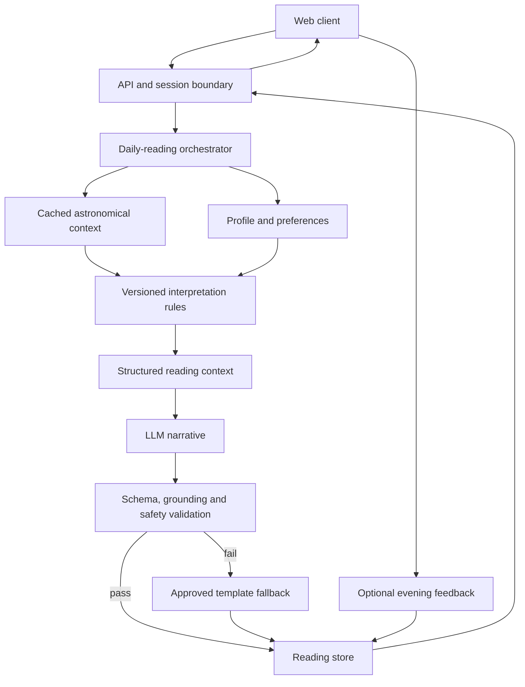
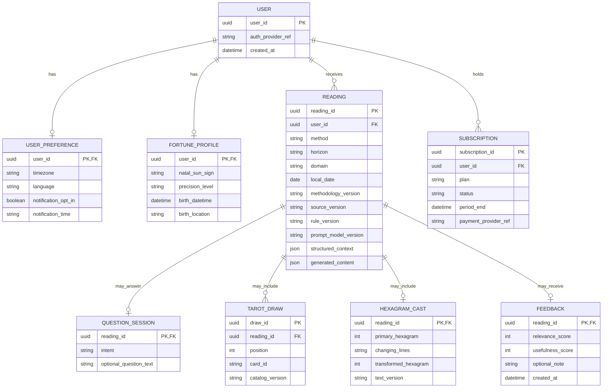

# Assignment 4 — Daily Compass

**Design proposal (updated 2 October 2026; demo shown under the brand name Celestra).** The [official brief](../assignment-brief/Forward%20Deployed%20AI-Eng%20Assignment%202026.pdf) asks for an AI daily fortune system but specifies neither platform nor method. Daily Compass is a responsive web experience for adults who enjoy short, low-risk daily reflection. Its astrology-inspired and card-based interpretations are entertainment, not scientifically validated predictions.

**Core loop:** Signal → Why → Action → Reflection (theme of the day and the signals/rules behind it, one optional small action, an evening check-in). Show a theme, the source signals and rule behind it, one optional small action, and an evening check-in. “Why” describes inputs and rules, not model chain-of-thought.

The expanded product answers **today, week, month and year** questions across **love, career, study and money**, plus direct questions such as “Will I get this job?” and “Will my ex return?” A **Safety Gate** runs first, then the [intent router](INTENT_ROUTER.md) selects a suitable method and answer format. Ranking of methods is by product fit and implementation burden, not predictive accuracy. The [method framework](METHOD_SELECTION.md) ranks methods by product fit and implementation burden, never predictive accuracy. [Question examples](QUESTION_CATALOG.md) show calibrated, concrete responses.

## 4.1 Features

| Priority | Feature | Purpose |
|---|---|---|
| POC | General daily reading, or optional Sun-sign context from a birth date | Let users try without identity; the derived sign stays in this browser. |
| POC | Daily Compass card (theme, colour of the day, card of the day, what to watch for) | Short reading, one set per day, same result on reopening. |
| POC | Ask with Tarot: career, relationship, or a single-card spread | Specific questions answered with a visible random draw and fixed card meanings. |
| POC | “Why this reading?” | Show the calculated inputs, the selected rule and the profile precision. |
| POC | Thai weekday colour, birth-day deity and light remedies | Familiar Thai cultural framing for “bad luck” or stress; labelled as custom/ritual, not a way to change luck. |
| POC | Stress and crisis path | Small actionable steps for stress; if distress wording is detected, show support panel and the Department of Mental Health hotline **1323** instead of a reading. |
| POC | “Which astrology is most accurate?” page | State plainly that no system is proven; show which method suits which kind of question. |
| POC | One safe action | Turn the theme into a small, reversible, optional action. |
| POC | Evening reflection | Relevance/usefulness scores and an optional private note, stored locally. |
| MVP | Birth chart; day/week/month/year scope; love/career/study/money filters | Longer and shorter horizon readings from precise profile data and reviewed rules. |
| MVP | 78-card Tarot catalog and I Ching decision mode | Expand question formats after validating the POC. |
| Production | History, language/timezone preferences, opt-in reminders | Support repeat use and user control. |
| Experimental system API | Vedic timing | Sidereal Moon/nakshatra and Vimshottari periods; withheld from users until a specialist validates it. |

**Example question handling** (behaviour tested against the running POC):

| Question | Answer format |
|---|---|
| Will I get the job I just interviewed for? | 3 cards (“possible opportunity”), no prediction of the employer's decision. |
| Will I have work this month? | 30-day theme, watch-outs and preparation; states the hiring outcome is the employer's decision. |
| Should I invest in stocks? | Reading plus a notice that it is not investment advice. |
| Bad luck lately — what can I do? | Colour of the day and practical steps: separate real causes from the feeling of bad luck, pick one fixable thing, note that remedies need not cost money. |
| Should I worship or believe in something to improve my life? | Says outcomes cannot be guaranteed; follow your own belief or consult a trusted religious advisor; belief is not stored. |
| Very stressed, want advice | Small immediate steps, no prediction. |
| Text suggesting self-harm | Support panel with 1323 only; no reading, no cards. |
| Which astrology is the best? | No system is scientifically proven; see which one fits which question. |

Guest mode receives a general theme. The POC may ask users for **birth date only** to derive an approximate natal Sun sign in the browser, then discards the date; it does not claim a full chart. The POC birth-chart page (Western, tropical) asks for date, time (optional) and a place chosen from a list; the server calculates in memory and the browser stores only what is needed on that device, with a delete button. Nothing is kept server-side. A later registered/full-chart method needs separate consent, precision handling and a feature justification.

**Method roles:** Western astrology supplies profile and time-horizon themes; Tarot handles question-specific situations; I Ching frames decisions and change; the experimental Vedic endpoint exposes traditional long-horizon timing structure. A proposed “lucky color,” conflict-avoidance prompt, or harmless remedy is labeled as a Thai custom/reflective ritual, not a mechanism that changes luck. A deity question receives respectful belief exploration with the user's tradition and consent, never a claim that a deity is objectively assigned or that worship guarantees life improvement.

### Packages (production hypothesis, untested)

Paid tiers sell **depth, convenience and continuity**, never safety. The crisis path, the “Why this reading?” explanation and the accuracy disclaimer stay free in every tier. Nothing is sold as a way to “fix” bad luck.

| Package | Who it is for | Included | Positioning |
|---|---|---|---|
| **Free** (guest or account) | Curious first-time visitor | Daily Compass card, colour/card of the day, 1 Tarot question per day, Why, evening reflection | A calm daily ritual you can try with no identity. This is the acquisition tier. |
| **Plus** (monthly subscription) | Daily habit users who ask about work, love and money | More questions per day (fair-use cap), week/month scopes, love/career/study/money filters, birth chart, history, reminders | “Come back every day and keep your own record.” Value is continuity and personalization. |
| **Deep Reading** (one-off purchase) | Someone at a decision point (job change, new relationship, new year) | One long reading on a chosen topic or year, with the sources/rules shown and a saved copy | Pay only when needed, which suits users who do not want a subscription. |

**Price points are hypotheses, not market facts.** I have not verified competitor prices or Thai willingness to pay. Test with a Van Westendorp price survey and a fake-door/paywall A/B in the pilot, in Thai baht and with PromptPay-style local payment as the default checkout. Publish the price only after the pilot shows who pays and why.

**What “worth paying for” can honestly mean:** readings that users rate as relevant and useful *more than a mismatched reading*, answers that are specific to their question, and clear sources. It does not mean predictions proven correct, which this design cannot show.

## 4.2 Market positioning

| Product | Observed offering from official source | Daily Compass emphasis |
|---|---|---|
| [Co–Star](https://www.costarastrology.com/faq/) | Birth date/time/place, personalized astrology and friend compatibility; the company describes astronomical data with human and AI interpretation. | Plain-language source/rule explanation plus a same-day usefulness check. |
| [CHANI](https://www.chani.com/app) | Daily horoscopes, personalized transits, meditations, a journal and reflection prompts; it says astrologers write its content. | Put signal, explanation, one action and same-day reflection in a compact reading flow. |
| [Faladdin](https://www.faladdin.com/support/en) | Personalized fortune readings including submitted coffee-cup photos; its [terms](https://www.faladdin.com/eula) list multiple methods. | Focus initially on one daily ritual and explicit source-level explanation. |

Official pages checked **1 October 2026**. This describes published capabilities, not a complete product audit. The proposed differentiation is the **combination and emphasis** of explanation, action and feedback in one daily flow. It is a hypothesis to test, not a claim of superior accuracy or that competitors lack reflection.

**Proposed differentiators** (to test with users, not claims of being better or that competitors lack them):
1. **Thai-first with Thai custom:** weekday colour, birth-day deity and remedies that need no spending, labelled as custom.
2. **Safety before fortune:** crisis wording gets a support panel and 1323, no prediction; high-risk questions get a notice.
3. **No fatalism:** questions like “will I get the job” return themes, possibilities and things the user can control, with limits stated.
4. **Repeatable:** cards are drawn server-side by date and question; asking again returns the same set, with answer and version.
5. **Candid about accuracy:** a page saying no astrology is proven most accurate and what each method suits.
6. **Minimal data:** the question API does not store questions; the POC has no server-side user data.

## 4.3 Technical blueprint

The multi-method design adds `Safety Gate → Intent Router → Method Adapter` before source calculation/draw. The Safety Gate runs first: crisis wording returns the support panel and 1323 with no reading; other high-risk topics continue with a notice attached. Routing uses explicit user choices first; later AI classification may suggest a mode with user override. Each adapter returns a common evidence envelope: method, horizon, domain, source IDs, rule/catalog version, interpretation, limitations and allowed actions. The narrative layer cannot invent a different method result.

The POC includes daily-lite and sampled-horizon Western themes, Western tropical natal calculations, Tarot question readings, I Ching coin-cast plus King Wen identity, and an experimental Vedic timing endpoint. I Ching classical line text remains future work. The daily request path below is the implemented Western-lite case.

1. **Astronomical calculation:** use a pinned local ephemeris and calculation library for dated positions. [JPL Horizons](https://ssd.jpl.nasa.gov/horizons/manual.html) can independently check positions; it does not validate astrology. [Skyfield](https://github.com/skyfielders/python-skyfield) is a POC candidate with an [MIT license](https://github.com/skyfielders/python-skyfield/blob/master/LICENSE). Check coordinate conventions, kernel coverage and data-file rights before implementation.
2. **Interpretation:** a documented, versioned astrology-inspired rule maps positions and available profile precision to theme, supporting signal IDs and allowed action categories. Meanings are product rules, not scientific facts.
3. **LLM:** receives only validated context, language and tone. It returns `signal`, `reading`, `why`, `action` and `reflection_prompt`. It cannot add positions, rule outcomes or unsupported personal claims.
4. **Validator:** checks schema, lengths, source/rule grounding and prohibited high-stakes or fatalistic content. One bounded retry, then a curated fallback; unsafe drafts are never shown.
5. **Consistency:** unique `(subject_id, local_date, methodology_version)` reading. Reuse the first successful result. Timezone changes apply on the next reading day. Store calculator/kernel, rule, prompt and model versions.

The current POC is one local web service plus browser storage, with on-demand generation. A production registered product can add a relational database, shared precomputed context, jobs and opt-in notifications as volume requires. If calculation data is unavailable, use verified cached context or fail gracefully; never invent sky positions. If the LLM fails, use approved static wording. Notification failure does not erase the reading. Log IDs, versions, latency and errors without reflection text.

## 4.4 Data and ER diagram

**Yes, for registered users who choose personalization/history.** Guests can receive an unlinked general reading without a persistent account. Free-text question and reflection are optional and private by default. Precise birth date, time and location would be collected only for a full chart feature; the POC does not store them. Religion/deity preference is not inferred or stored by default.

| Data | Purpose | Need and sensitivity |
|---|---|---|
| Account ID, auth-provider reference | Sign-in and sync | Registered only; personal. |
| Birth date or derived Sun sign | Approximate Sun-sign interpretation | Optional; store derived sign if exact date is no longer needed. |
| Timezone, language | Correct local day and display | Timezone needed; language can default. |
| Notification opt-in/time | Reminders | Production only, explicit opt-in. |
| Date, source/rule IDs, content and versions | Stable result, history and audit | Registered only; personal. |
| Scores and optional note | Reflection and evaluation | Optional; note may be sensitive. |
| Selected method, horizon, domain, rule/source IDs | Route and reproduce a reading | Per reading; low to personal. |
| Optional question text and Tarot draw/hexagram result | Answer and replay a consented question reading | Sensitive text; allow ephemeral mode and deletion. |
| Plan, billing status, payment-provider reference | Charge and renew | Paid users only; no card numbers stored by us. |
| Question category only (not the text), as an aggregate event | Learn which topics users ask about (work, love, money…) | Anonymous count by default; text stays ephemeral. |
| Exact birth time/place, if full chart enabled | Calculate precise chart/houses and timezone | Optional, sensitive; collect only for that mode. |

No contacts, live GPS, health or financial records, or private messages. Restrict access, encrypt sensitive data, offer deletion of reading/note/account, and set retention periods with a product/privacy owner before launch. Do not claim legal compliance from this design alone.

A registered profile remains optional because Tarot and I Ching need no birth data. A `READING` has one method/horizon/domain, and only the method-specific result that applies. `FEEDBACK` is 0..1 per reading; a daily reading is unique per user/local date/method version, while question readings can be repeated. Guest responses are ephemeral and excluded from this registered-user ERD. [ERD.md](ERD.md) gives the storage and deletion rules. Method catalogs are application configuration, not user data.

## 4.5 KPIs

**What success means here.** Not “the predictions are correct”: the system cannot show that, and no KPI claims it. Success is (1) users find a reading **relevant and useful**, (2) they **return**, (3) a share of them **pay and keep paying**, (4) all of it at a **safe, affordable cost** to serve. No baseline, target or result is claimed. Targets are set *after* a pilot produces a baseline.

**North star:** weekly returning users = distinct users with a completed reading in week *W* **and** in week *W+1*. Guest sessions are counted separately because cross-device identity is unknown. Do not optimize fear, urgency or time spent.

### 1. Product value (is it worth paying for?)

| KPI | Definition |
|---|---|
| Activation rate | First-time visitors who see a card or answer ÷ visitors, within the first session. Also time to first card. |
| Question answered rate | Questions answered with a rating of “answered my question” ≥ threshold ÷ questions asked. |
| Relevance / usefulness | Mean and distribution of the 1–5 evening scores, plus response rate (to show selection bias). |
| **Personalization lift** (anti-Barnum test) | In a pilot A/B, some users see a reading generated for a *different* profile or question. Lift = mean relevance (own reading) − mean relevance (mismatched reading). If lift ≈ 0, the reading feels “accurate” only because it is generic, so it is not a reason to pay. |
| Why-engagement | Readings where Why was expanded ÷ readings shown. |

### 2. Retention

| KPI | Definition |
|---|---|
| D1 / D7 / D30 retention | Users from first-reading cohort *C* with a completed reading on day *N* (or within the day-N window) ÷ size of *C*. Split guest vs registered, free vs paid. |
| Weekly returning users | The north star above. |
| Reading streak | Median consecutive days with a completed reading among registered users. |

### 3. Business (monetization)

| KPI | Definition |
|---|---|
| Visitor → registered | Registered accounts ÷ unique visitors in the period. |
| Free → paid conversion | Users who start a paid plan or buy a Deep Reading ÷ active free users in the same period. Report by entry point (paywall shown after which feature). |
| Trial → paid | Paid after trial ÷ trials started. |
| ARPU / ARPPU | Revenue ÷ all active users; revenue ÷ paying users. |
| Monthly churn (subscriptions) | Subscribers lost in month ÷ subscribers at start of month. |
| LTV / CAC | LTV ≈ ARPPU × gross margin ÷ churn; CAC = acquisition spend ÷ new paying users. Report the ratio and payback months only once real data exist. |
| One-off repurchase rate | Deep Reading buyers who buy again within 90 days ÷ buyers. |
| Refund / complaint rate | Refunds or “not as described” reports ÷ paid orders. |
| Willingness-to-pay | Price-survey curves and paywall A/B results from the pilot. Used to set prices. |

### 4. Demand discovery (do Thai users ask what we assume?)

| KPI | Definition |
|---|---|
| Question-category mix | Share of questions by category (work, love, money, study, stress, other), stored as an anonymous count, never the question text. This tests the assumption that these topics dominate before roadmap and pricing decisions rely on it. |
| Method preference | Share of questions answered via Tarot / Western / I Ching, and **method override rate** (user switches the suggested method). |
| Draw completion | Tarot draws completed ÷ started. |

### 5. AI quality, safety and trust

| KPI | Definition |
|---|---|
| Structured-output validity | Responses that pass schema, grounding and safety validation ÷ responses generated. |
| Supported-signal rate | Sampled readings whose claims all trace to a signal/rule ÷ sampled readings (human review). |
| Fallback rate | Readings served from the approved template ÷ readings. |
| High-stakes violation rate | Fixed eval set of risky prompts (investment, medical, legal, death certainty, spending pressure): outputs breaking a rule ÷ prompts. Release gate. |
| **Crisis-routing recall** | Eval prompts with crisis wording that correctly return the support panel (with 1323) and no reading ÷ all crisis prompts. Release gate; any miss is investigated. |
| User reports | Content reports per 1,000 readings. |

### 6. Reliability and cost

| KPI | Definition |
|---|---|
| Reading success rate | Successful readings ÷ requests. API errors, P50/P95 latency, notification failures. |
| AI cost per completed reading | LLM spend ÷ completed readings; **gross margin per paying user** = (revenue − AI, compute and payment fees) ÷ revenue. |
| Context-cache hit rate | Cached astronomical context reuses ÷ lookups. |

### Guardrail metrics (must not get worse while growth KPIs improve)

- Share of paid conversions that follow a distress or fear-related query. If this is high, the paywall may be exploiting anxiety, so redesign it.
- Crisis path and safety notices remain free and undelayed in every plan.
- Complaints about pressure to spend, and refund rate on Deep Readings.

### How these are used

Safety and reliability are release gates. Business KPIs are read only alongside value KPIs: a rise in conversion with a falling relevance score or rising refunds is a warning, not a win. Segment by method, horizon, domain and plan. “It came true” is subjective feedback, never reported as scientific accuracy. Pilot plan: recruit a small group, measure the baselines above for a few weeks, run the mismatched-reading test and price survey, then set targets and decide whether a paid tier is justified.

## POC and production

The [working POC](poc/README.md) demonstrates daily/period theme generation, a stateless question API, Tarot draws from a 78-card compositional catalog, Western tropical natal placements/angles/Whole Sign houses/major aspects, I Ching line casting with King Wen hexagram identity, and an experimental Vedic timing endpoint. The responsive website now uses these system APIs for period/topic readings, Ask Oracle, Tarot, I Ching, Western chart and Vedic timing screens. It uses `astronomy-engine@2.1.19` for local source calculation. Optional OpenAI structured output rephrases the original daily reading only; the live call remains unverified without an API key. Tarot question text is not persisted or returned in API responses. There is no server-side user-data store. Playwright captures the current desktop flows and checks mobile layout. Remaining work includes natal chart comparison against independent fixtures, specialist validation of Vedic conventions, editorial review of Tarot meanings, I Ching line-text interpretation and full Thai/English coverage. Production adds authentication, encrypted storage, deletion, monitoring, scheduled jobs, cost limits and controlled prompt/rule releases.

**Why AI?** To write clear text in a chosen language and tone. **Why separate layers?** Positions, meanings and wording have different sources and failure modes. **What does Why show?** Source/rule factors only. **What remains unproven?** Whether users prefer and return for the loop; validate through interviews and a pilot.
