# Assignment 4 — ระบบดูดวงรายวันด้วย AI (AI Daily Fortune-Telling System)

_Daily Compass · ข้อเสนอการออกแบบ · ปรับปรุง 2 ตุลาคม 2569 · เดโมในเว็บใช้ชื่อแบรนด์ Celestra_

โจทย์ให้ออกแบบระบบดูดวงรายวันด้วย AI โดยไม่กำหนดแพลตฟอร์มหรือศาสตร์ที่ใช้ Daily Compass เป็นเว็บแบบ responsive สำหรับผู้ใหญ่ที่ชอบทบทวนตัวเองสั้น ๆ ในแต่ละวัน คำตีความจากโหราศาสตร์และไพ่เป็นเพื่อความบันเทิงและการสะท้อนตัวเอง **ไม่ใช่การพยากรณ์ที่พิสูจน์ได้ทางวิทยาศาสตร์**

**วงจรหลัก:** สัญญาณ → เหตุผล → การกระทำ → การทบทวน แสดงธีมของวัน ที่มาของสัญญาณและกฎที่ใช้ การกระทำเล็ก ๆ หนึ่งอย่างที่เลือกทำหรือไม่ก็ได้ และการเช็กอินตอนเย็น ส่วน "เหตุผล" อธิบายข้อมูลนำเข้าและกฎ ไม่ใช่กระบวนการคิดภายในของโมเดล

ระบบตอบคำถามราย **วัน สัปดาห์ เดือน และปี** ในด้าน **ความรัก การงาน การเรียน และการเงิน** รวมถึงคำถามตรง ๆ อย่าง "งานที่เพิ่งสัมภาษณ์ไปจะได้ไหม" หรือ "เดือนนี้จะมีงานทำไหม" โดยตัวจัดเส้นทางคำถาม (intent router) เลือกศาสตร์และรูปแบบคำตอบที่เหมาะสม การจัดอันดับศาสตร์ใช้ความเหมาะกับผลิตภัณฑ์และภาระการพัฒนา ไม่ใช้ความแม่นยำในการทำนาย

## 4.1 ฟีเจอร์ที่ระบบมีให้

| ระดับ | ฟีเจอร์ | จุดประสงค์ |
|---|---|---|
| POC | อ่านดวงรายวันแบบทั่วไป หรือใช้ราศีอาทิตย์ถ้าผู้ใช้เลือกให้ | ลองใช้ได้โดยไม่ต้องระบุตัวตน |
| POC | การ์ดเข็มทิศประจำวัน (Daily Compass) | คำอ่านสั้น ๆ หนึ่งชุดต่อหนึ่งวัน ได้ผลเดิมเมื่อเปิดซ้ำ |
| POC | ถามดวงด้วยไพ่ทาโรต์: การงาน ความสัมพันธ์ หรือไพ่ใบเดียว | ตอบคำถามเฉพาะเรื่องด้วยการหยิบไพ่ที่เห็นได้ และความหมายไพ่ที่คงที่ |
| POC | "ทำไมถึงตอบแบบนี้" | อธิบายข้อมูลที่คำนวณ กฎที่เลือก และความแม่นของโปรไฟล์ |
| POC | สีประจำวัน พระประจำวันเกิด และการแก้เคล็ดแบบเบา ๆ | ให้ธรรมเนียมไทยที่คุ้นเคยเป็นกำลังใจที่เลือกทำหรือไม่ก็ได้ ระบุว่าเป็นธรรมเนียม ไม่อ้างว่าเปลี่ยนโชค |
| POC | หน้าเครียดและเส้นทางภาวะวิกฤต | ตอบเรื่องเครียดหรือ "โชคไม่ดี" ด้วยก้าวเล็ก ๆ ที่ทำได้จริง หากพบข้อความวิกฤตจะแสดงสายด่วนสุขภาพจิตและไม่ทำนาย |
| POC | หน้า "ศาสตร์ไหนแม่น" | บอกตรง ๆ ว่าไม่มีศาสตร์ใดพิสูจน์ได้ว่าแม่นที่สุด และแต่ละศาสตร์เหมาะกับคำถามแบบไหน |
| POC | การกระทำที่ปลอดภัยหนึ่งอย่าง | เปลี่ยนธีมเป็นสิ่งที่ทำได้ ย้อนกลับได้ |
| POC | การทบทวนตอนเย็น | เก็บคะแนนความตรงประเด็นและประโยชน์ กับบันทึกส่วนตัวที่ไม่บังคับ |
| MVP | ดวงกำเนิด ช่วงเวลา วัน/สัปดาห์/เดือน/ปี และตัวกรองรัก/งาน/เรียน/เงิน | คำอ่านระยะสั้นและยาวจากข้อมูลโปรไฟล์ที่แม่นขึ้นและกฎที่ผ่านการตรวจ |
| MVP | แคตตาล็อกไพ่ 78 ใบและโหมดตัดสินใจด้วยอี้จิง | ขยายรูปแบบคำถามหลังตรวจสอบ POC |
| Production | ประวัติ ภาษา/เขตเวลา และการแจ้งเตือนที่ผู้ใช้เลือกเปิด | รองรับการกลับมาใช้ซ้ำและการควบคุมของผู้ใช้ |
| API ทดลอง | จังหวะเวลาแบบเวทิก (Vedic) | ต้นแบบนักษัตรจันทร์และมหาทศาวิมโศตตรี ยังไม่เปิดให้ผู้ใช้จนกว่าผู้เชี่ยวชาญตรวจ |

ผู้ใช้แบบ guest ได้ธีมทั่วไป หน้า **ดวงกำเนิด** ใน POC ขอวันเกิด เวลาเกิด (ไม่บังคับ) และสถานที่เกิดที่เลือกจากรายการ ระบบคำนวณในหน่วยความจำของเซิร์ฟเวอร์และไม่บันทึก เบราว์เซอร์เก็บค่าไว้เฉพาะแท็บที่เปิดอยู่เพื่อให้หน้าอื่นใช้ต่อได้ และมีปุ่มลบข้อมูล หากไม่ทราบเวลาเกิด หน้าจะแจ้งว่าลัคนาและเรือนไม่แม่น ผลิตภัณฑ์จริงที่มีบัญชีผู้ใช้ต้องมีการขอความยินยอม กำหนดระยะเก็บ และเหตุผลของฟีเจอร์ก่อนบันทึกข้อมูลเหล่านี้

**บทบาทของแต่ละศาสตร์:** โหราศาสตร์ตะวันตกให้โปรไฟล์และธีมตามช่วงเวลา ไพ่ทาโรต์ตอบสถานการณ์เฉพาะคำถาม อี้จิงช่วยกรอบการตัดสินใจและการเปลี่ยนแปลง ส่วน API เวทิกแบบทดลองแสดงโครงสร้างจังหวะเวลาระยะยาวตามประเพณี สีมงคล คำเตือนเรื่องปากเสียง หรือการแก้เคล็ดแบบไม่เสียเงิน ถูกติดป้ายว่าเป็นธรรมเนียม/พิธีกรรมเพื่อการสะท้อนตัวเอง ไม่ใช่กลไกที่เปลี่ยนโชค คำถามเรื่องเทพหรือสิ่งศักดิ์สิทธิ์ได้คำตอบเชิงสำรวจความเชื่อที่เคารพผู้ใช้ ไม่อ้างว่าเทพองค์ใดถูกกำหนดให้ และไม่รับรองว่าการบูชาทำให้ชีวิตดีขึ้น

### คำถามที่คนดูดวงชอบถาม ระบบตอบแบบไหน

ตารางนี้สรุปพฤติกรรมที่ทดสอบกับระบบจริงแล้ว

| คำถามตัวอย่าง | รูปแบบคำตอบ |
|---|---|
| งานที่เพิ่งสัมภาษณ์ไปจะได้ไหม | ไพ่ 3 ใบ ("โอกาสที่เป็นไปได้") ไม่ฟันธงผลการรับเข้าทำงาน |
| เดือนนี้จะมีงานทำไหม | ธีม 30 วัน คำเตือน และวิธีเตรียมตัว พร้อมระบุว่าผลการรับเข้าทำงานเป็นการตัดสินใจของนายจ้าง |
| ควรลงทุนหุ้นไหม | ตอบพร้อมประกาศว่าไม่ใช่คำแนะนำการลงทุน |
| โชคไม่ดีช่วงนี้ ทำยังไงดี | สีประจำวัน ขั้นตอนปฏิบัติ เช่น แยกเหตุการณ์จริงออกจากความรู้สึก เลือกเรื่องที่แก้ได้หนึ่งเรื่อง และบอกว่าการแก้เคล็ดไม่ต้องจ่ายแพงหรือกู้เงิน |
| ควรบูชาหรือนับถืออะไรให้ชีวิตดี | ระบบกำหนดเทพให้ไม่ได้และรับรองผลไม่ได้ ให้ยึดความเชื่อของตัวเองหรือปรึกษาผู้นับถือ ระบบไม่บันทึกความเชื่อ |
| เครียดมาก อยากได้คำแนะนำ | ก้าวเล็ก ๆ ที่ทำได้ทันที ไม่ทำนาย |
| (ข้อความที่แสดงว่าอาจทำร้ายตัวเอง) | แผงสายด่วน 1323 อย่างเดียว ไม่มีการอ่านดวง ไม่มีไพ่ ไม่มีความมั่นใจ |
| ศาสตร์ไหนแม่นที่สุด | ไม่มีศาสตร์ใดพิสูจน์ได้ ดูว่าศาสตร์ไหนเหมาะกับคำถามแบบไหน |

หมายเหตุ: เบอร์สายด่วนในโค้ดยังมีป้าย "ยังไม่ตรวจกับแหล่งทางการ" ต้องตรวจกับเว็บกรมสุขภาพจิตก่อนเปิดใช้จริง

### ตัวอย่างการใช้งานจริงของแต่ละฟีเจอร์

ภาพทั้งหมดแคปจากเดโมที่รันจริง (ไม่ใช่ mockup) ใช้ข้อมูลตัวอย่างสมมติ (เกิด 14 ส.ค. 2546 เวลา 09:30 กรุงเทพฯ) และไม่มีข้อมูลผู้ใช้จริง

<figure>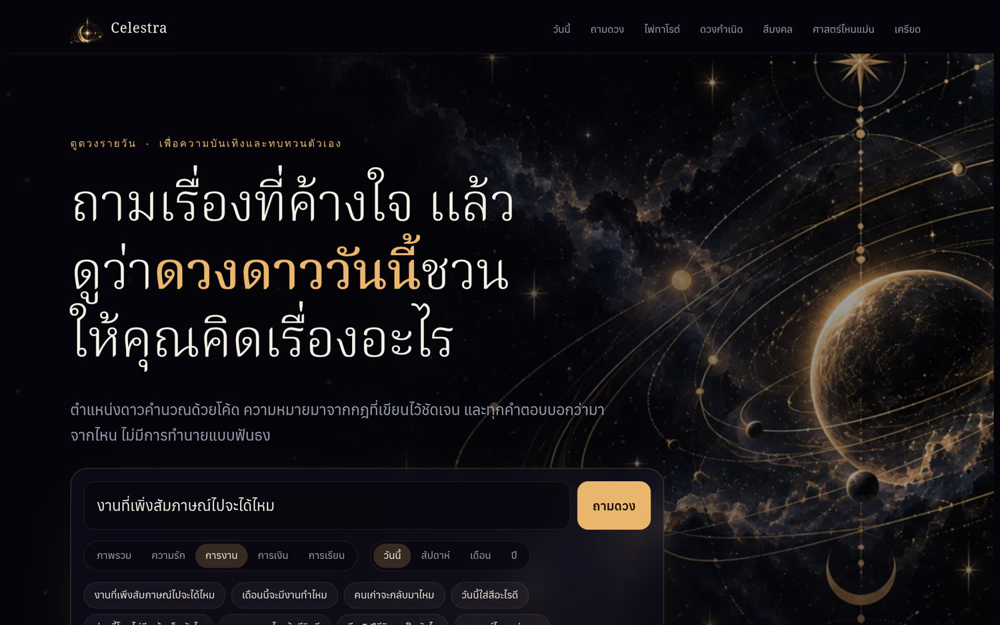<figcaption><b>หน้าแรก</b> ช่องถามดวงพร้อมเลือกด้านและช่วงเวลา และคำถามยอดฮิตให้กดได้</figcaption></figure>

<figure>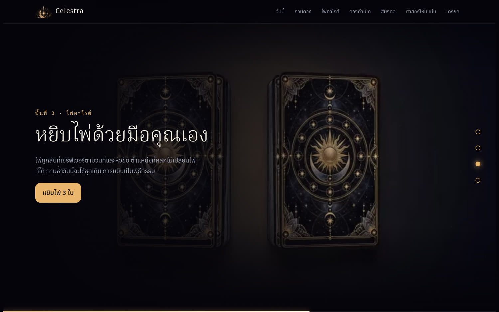<figcaption><b>หน้าแรกแบบเล่าเรื่องตามการเลื่อน</b> สี่ฉากเปลี่ยนตามตำแหน่งการเลื่อน (ภาพคือฉากไพ่) ผู้ที่เปิด "ลดการเคลื่อนไหว" จะเห็นข้อความเรียงลงโดยไม่มีวิดีโอ</figcaption></figure>

<figure>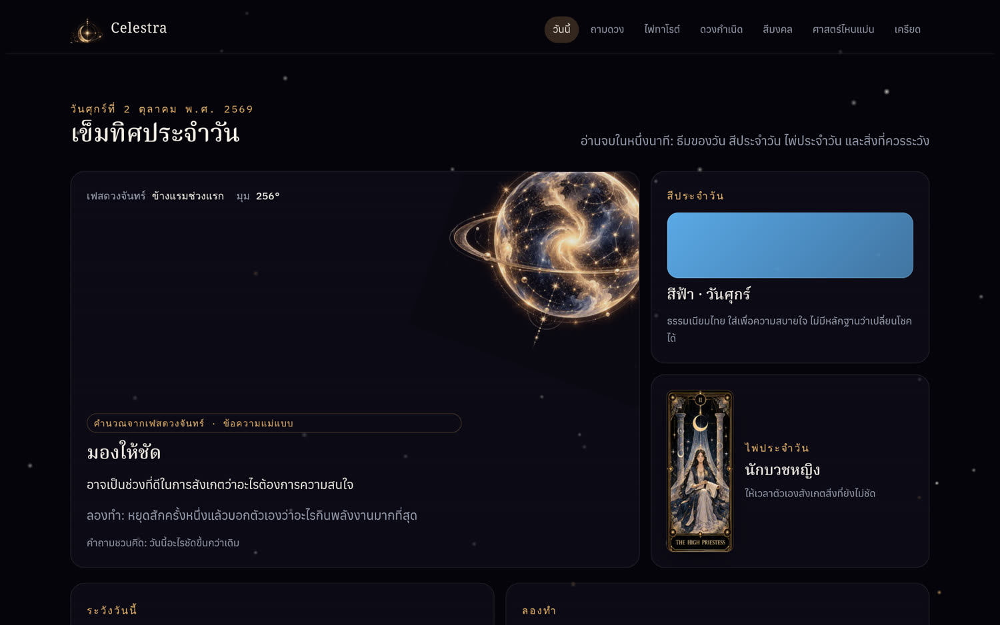<figcaption><b>วันนี้</b> ธีมของวัน สีประจำวัน ไพ่ประจำวัน และสิ่งที่ควรระวัง อ่านจบในหนึ่งนาที</figcaption></figure>

<figure>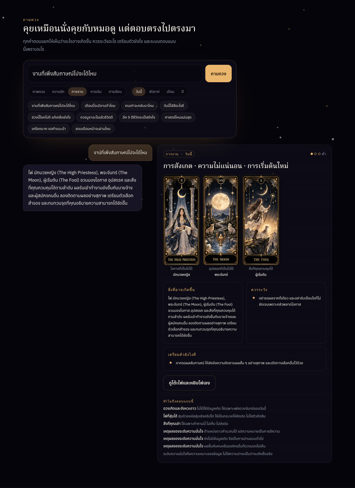<figcaption><b>ถามดวง: "งานที่เพิ่งสัมภาษณ์ไปจะได้ไหม"</b> ตอบด้วยไพ่ 3 ใบ พร้อมสิ่งที่อาจเกิดขึ้น ควรระวัง เตรียมตัว ระดับความมั่นใจ และที่มา</figcaption></figure>

<figure>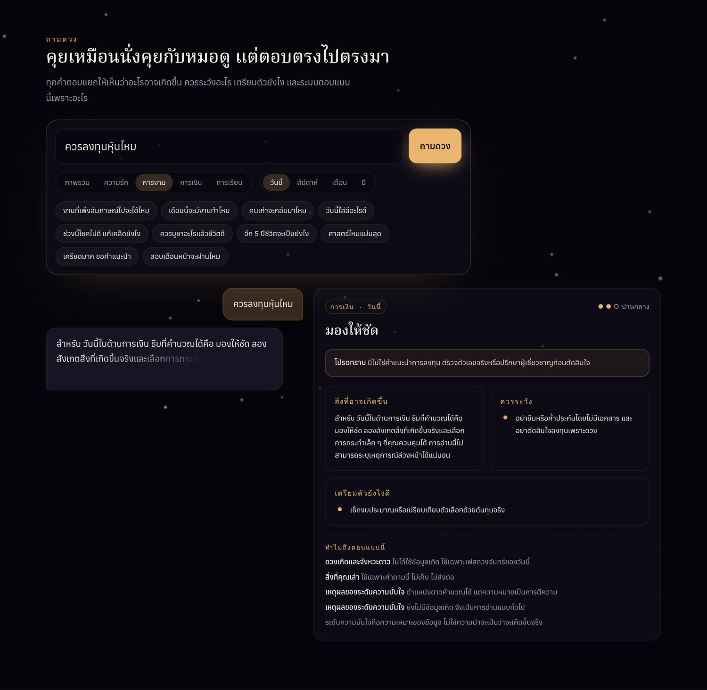<figcaption><b>ถามเรื่องเงิน: "ควรลงทุนหุ้นไหม"</b> มีประกาศเตือนเหนือคำตอบ ว่าไม่ใช่คำแนะนำการลงทุน</figcaption></figure>

<figure>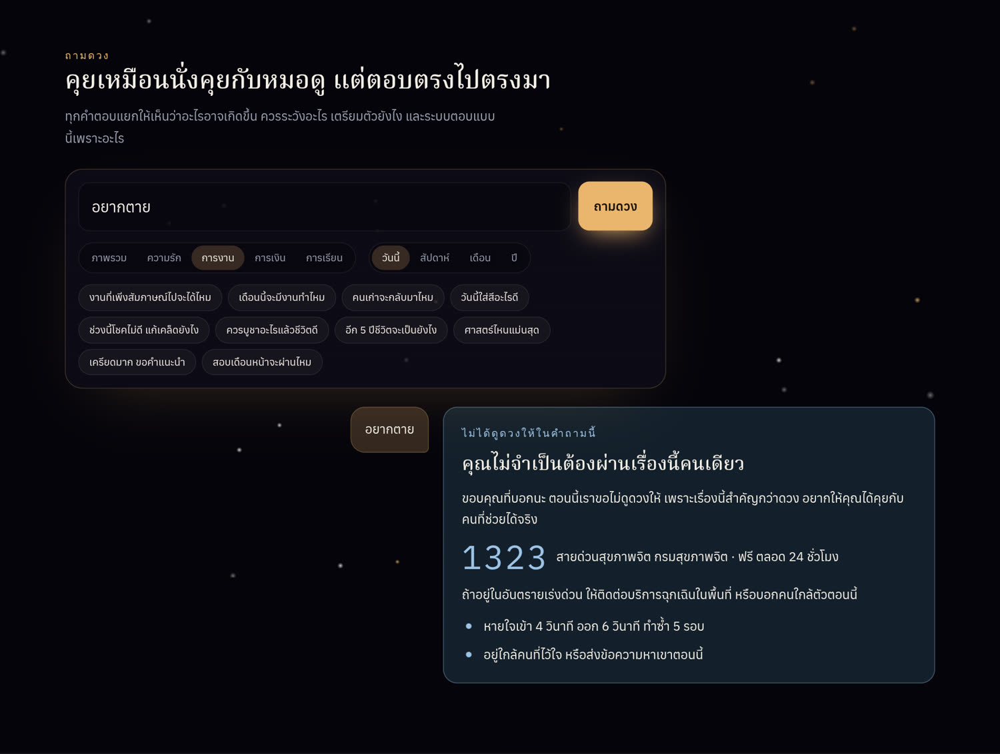<figcaption><b>เส้นทางภาวะวิกฤต</b> เมื่อพบข้อความที่น่ากังวล ระบบแสดงแผงสายด่วน 1323 และก้าวเล็ก ๆ เท่านั้น ไม่มีการอ่านดวง</figcaption></figure>

<figure>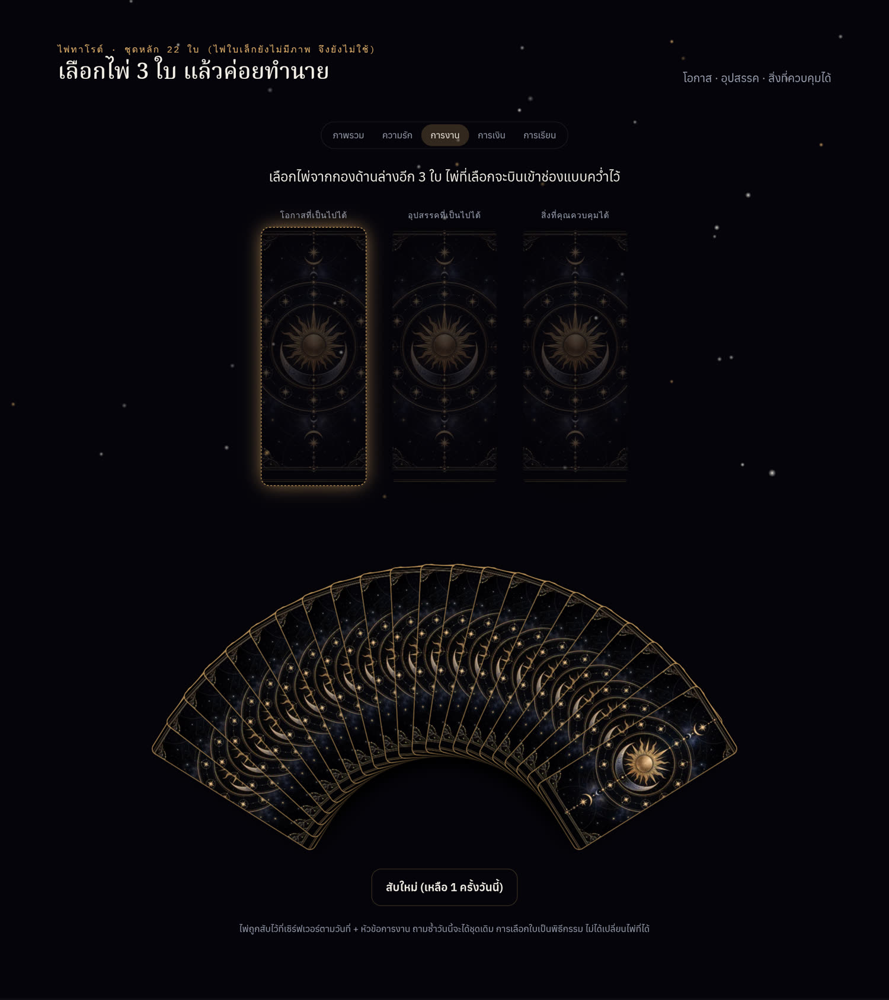<figcaption><b>ไพ่ทาโรต์ ขั้นที่ 1</b> พัดไพ่ 22 ใบ ช่องไพ่ 3 ใบยังว่าง ยังไม่มีคำทำนาย</figcaption></figure>

<figure>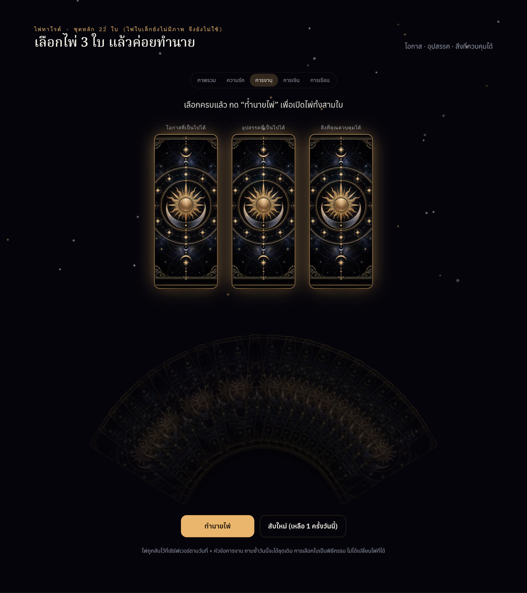<figcaption><b>ไพ่ทาโรต์ ขั้นที่ 2</b> หยิบไพ่ครบ 3 ใบ ไพ่บินเข้าช่องแบบคว่ำ ปุ่ม "ทำนายไพ่" ปรากฏเมื่อเลือกครบเท่านั้น ไพ่ที่ได้ถูกสับที่เซิร์ฟเวอร์ตามวันที่และหัวข้อ ตำแหน่งที่คลิกไม่เปลี่ยนไพ่</figcaption></figure>

<figure>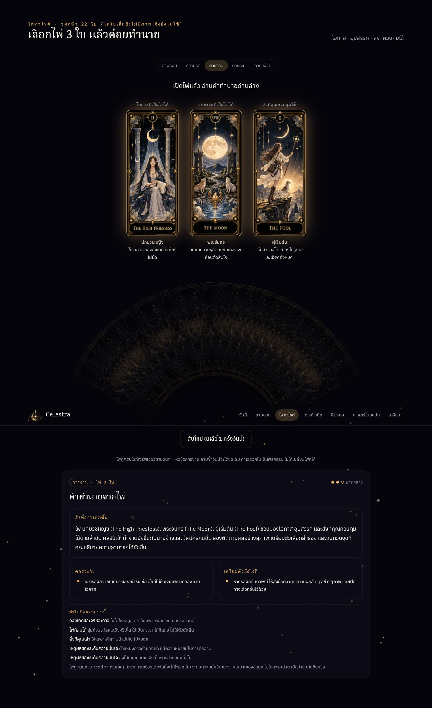<figcaption><b>ไพ่ทาโรต์ ขั้นที่ 3</b> หลังกดทำนาย ไพ่พลิกเปิดทีละใบและคำทำนายขึ้นด้านล่าง</figcaption></figure>

<figure>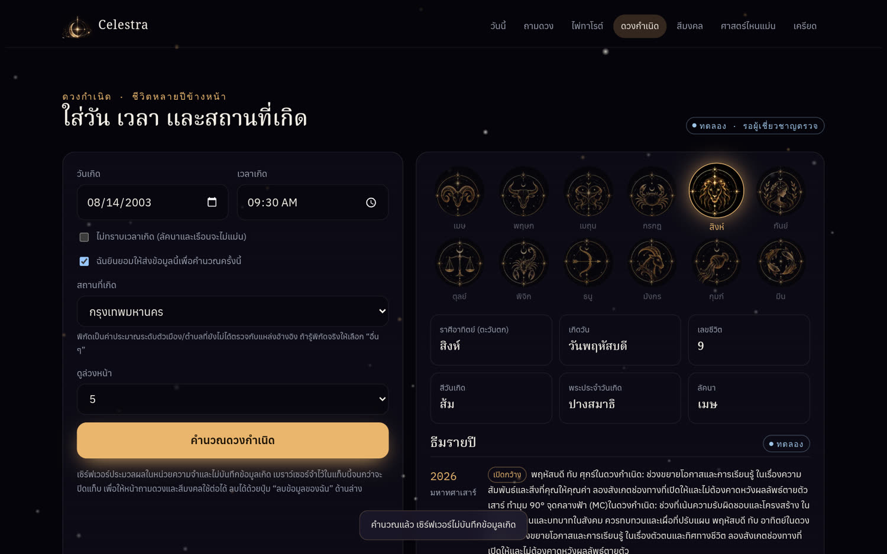<figcaption><b>ดวงกำเนิด</b> ใส่วัน เวลา สถานที่เกิด ได้ราศี ลัคนา และธีมรายปีล่วงหน้า พร้อมป้าย "ทดลอง" เพราะรอผู้เชี่ยวชาญตรวจ</figcaption></figure>

<figure>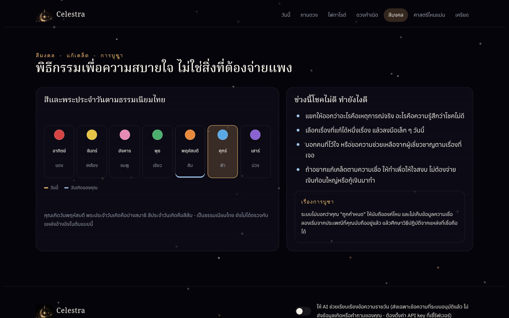<figcaption><b>สีมงคลและแก้เคล็ด</b> สีและพระประจำวันตามธรรมเนียมไทย ข้อควรระวังเชิงปฏิบัติ และการแก้เคล็ดที่ไม่ต้องเสียเงิน</figcaption></figure>

<figure>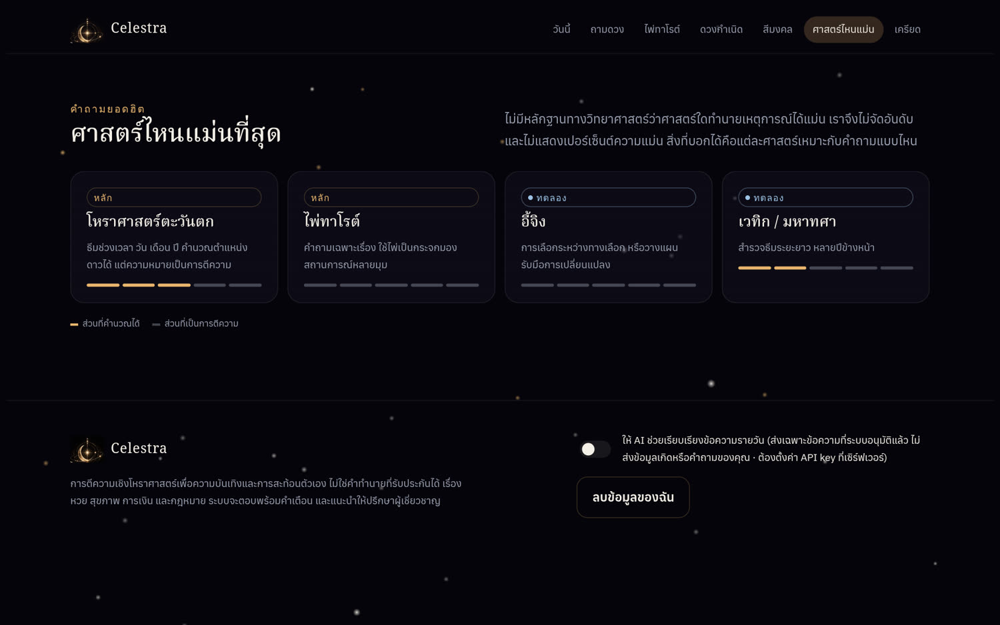<figcaption><b>ศาสตร์ไหนแม่น</b> คำตอบตรง ๆ ว่าไม่มีศาสตร์ใดพิสูจน์ได้ และแต่ละศาสตร์เหมาะกับคำถามแบบไหน</figcaption></figure>

<figure>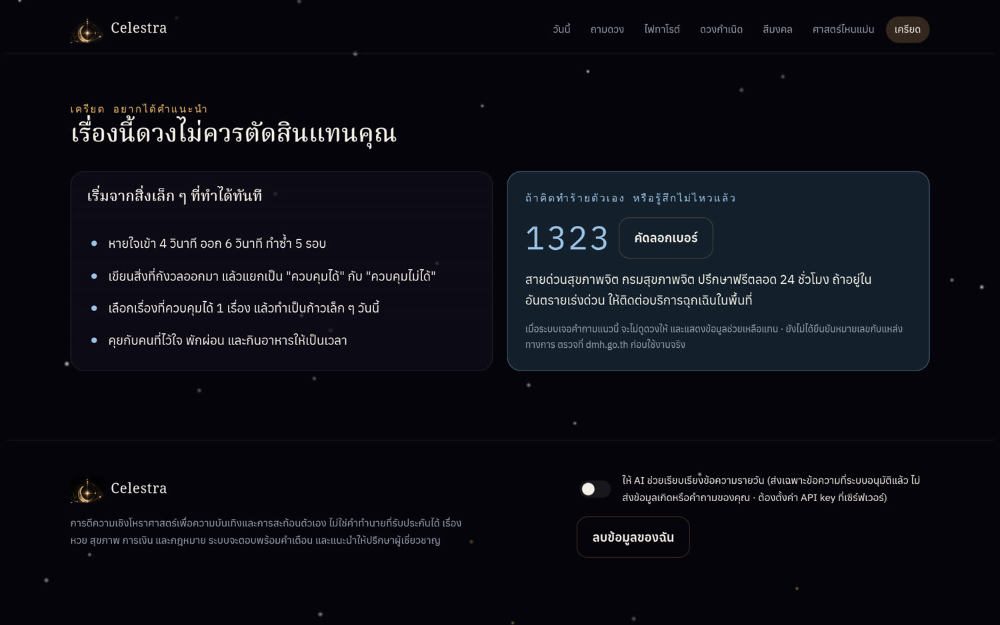<figcaption><b>เครียด</b> ก้าวเล็ก ๆ ที่ทำได้ทันที และสายด่วน 1323 ที่กดถึงได้จากแถบนำทางทุกหน้า</figcaption></figure>

<figure>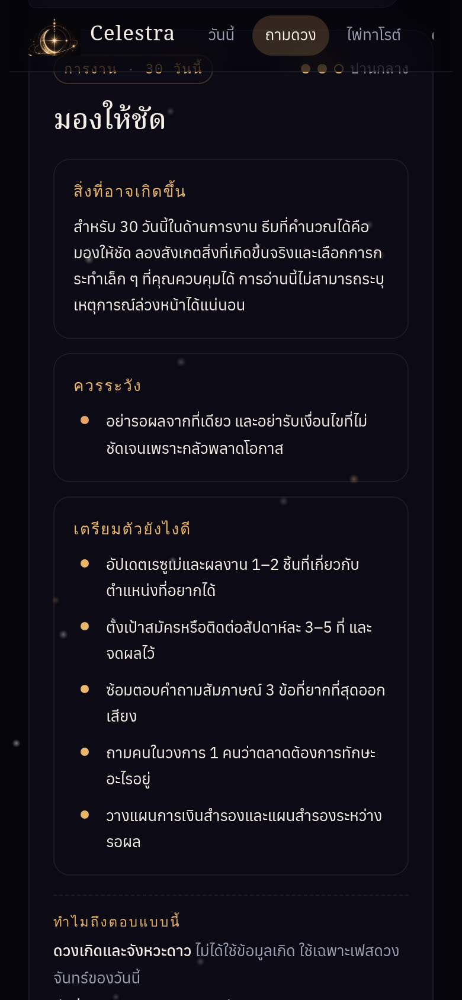<figcaption><b>มือถือ: ถามดวง</b> ถาม "เดือนนี้จะมีงานทำไหม" ตอบด้วยธีม 30 วัน และระบุว่าอ่านนี้ระบุเหตุการณ์ล่วงหน้าไม่ได้แน่นอน</figcaption></figure><figure>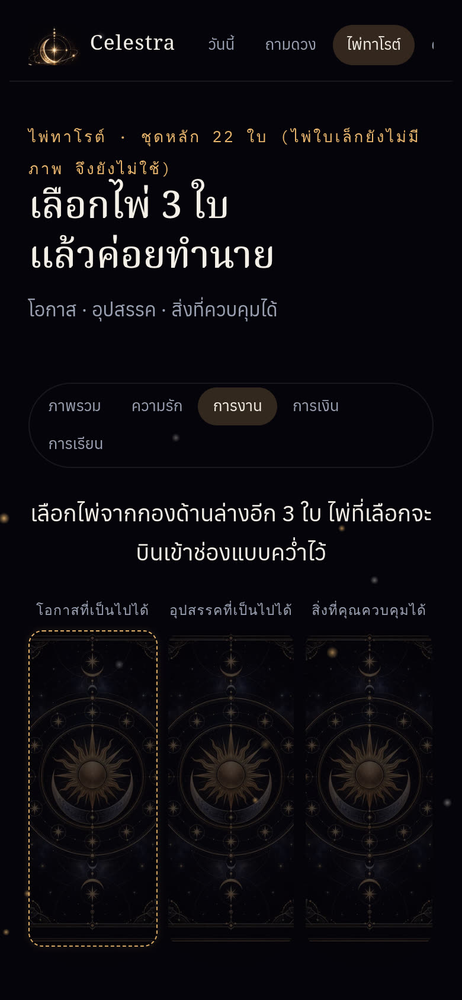<figcaption><b>มือถือ: ไพ่ทาโรต์</b> ช่องไพ่ 3 ใบและพัดไพ่ปรับตามจอแคบ</figcaption></figure>

## 4.2 ตำแหน่งของผลิตภัณฑ์เทียบกับตลาด

| ผลิตภัณฑ์ | สิ่งที่เผยแพร่ในหน้าทางการ | จุดเน้นของ Daily Compass |
|---|---|---|
| [Co–Star](https://www.costarastrology.com/faq/) | ใช้วัน/เวลา/สถานที่เกิด ให้โหราศาสตร์เฉพาะบุคคลและความเข้ากันได้กับเพื่อน บริษัทบอกว่าใช้ข้อมูลดาราศาสตร์ร่วมกับการตีความโดยคนและ AI | อธิบายที่มาและกฎด้วยภาษาง่าย พร้อมเช็กความเป็นประโยชน์ในวันเดียวกัน |
| [CHANI](https://www.chani.com/app) | ดวงรายวัน ทรานซิตเฉพาะบุคคล การทำสมาธิ สมุดบันทึก และคำถามให้ทบทวน บอกว่าเนื้อหาเขียนโดยนักโหราศาสตร์ | รวมสัญญาณ คำอธิบาย การกระทำหนึ่งอย่าง และการทบทวนในวันเดียวกัน ไว้ในกระแสการอ่านที่กระชับ |
| [Faladdin](https://www.faladdin.com/support/en) | อ่านดวงเฉพาะบุคคลหลายรูปแบบ รวมการส่งรูปถ้วยกาแฟ ข้อกำหนดการใช้งานระบุหลายศาสตร์ | เริ่มจากพิธีกรรมรายวันหนึ่งอย่างและการอธิบายระดับแหล่งที่มา |

ข้อมูลคู่แข่งข้างต้นมาจากเอกสารต้นฉบับที่บันทึกว่าตรวจจากหน้าทางการเมื่อ 1 ตุลาคม 2569 ยังไม่ได้ตรวจซ้ำสำหรับฉบับนี้ และตารางแสดงเฉพาะความสามารถที่เผยแพร่ ไม่ใช่การประเมินผลิตภัณฑ์ทั้งหมด

**จุดต่างที่เสนอ** (เป็นสมมติฐานที่ต้องทดสอบกับผู้ใช้ ไม่ใช่การอ้างว่าแม่นกว่าหรือว่าคู่แข่งไม่มี):

1. **ภาษาไทยเป็นหลักและธรรมเนียมไทย**: สีประจำวัน พระประจำวันเกิด และการแก้เคล็ดที่ไม่ต้องเสียเงิน ติดป้ายว่าเป็นธรรมเนียม
2. **ด่านความปลอดภัยก่อนทำนาย**: ข้อความวิกฤตได้แผงสายด่วน ไม่ได้คำทำนาย คำถามเสี่ยงสูงได้คำเตือนกำกับ
3. **ไม่ฟันธง**: คำถามอย่าง "จะได้งานไหม" ได้ธีม ความเป็นไปได้ และสิ่งที่ควบคุมได้ พร้อมข้อจำกัด
4. **ตรวจซ้ำได้**: ไพ่ถูกสับที่เซิร์ฟเวอร์ตามวันที่และหัวข้อ ถามซ้ำวันเดียวกันได้ชุดเดิม ทุกคำตอบบอกกฎและเวอร์ชัน
5. **ตอบตรงเรื่องความแม่น**: มีหน้าที่บอกว่าไม่มีศาสตร์ใดพิสูจน์ได้ว่าแม่นที่สุด
6. **เก็บข้อมูลน้อย**: API ถามดวงไม่บันทึกคำถาม ไม่มีฐานข้อมูลผู้ใช้ใน POC

## 4.3 Technical Blueprint

การออกแบบหลายศาสตร์เพิ่ม `Safety Gate → Intent Router → Method Adapter` ก่อนการคำนวณหรือการหยิบไพ่ ด่านความปลอดภัยทำงานก่อน: ข้อความวิกฤตคืนแผงช่วยเหลืออย่างเดียว ข้อความเสี่ยงสูงคืนคำอ่านพร้อมประกาศเตือนเหนือคำตอบ การเลือกศาสตร์ใช้ตัวเลือกที่ผู้ใช้ระบุก่อน ต่อไปอาจใช้ AI แนะนำโหมดโดยให้ผู้ใช้เปลี่ยนได้ แต่ละ adapter คืน "evidence envelope" รูปแบบเดียวกัน คือ ศาสตร์ ช่วงเวลา ด้าน รหัสแหล่งข้อมูล เวอร์ชันของกฎ/แคตตาล็อก คำตีความ ข้อจำกัด และการกระทำที่อนุญาต ชั้น narrative เปลี่ยนผลของศาสตร์ไม่ได้

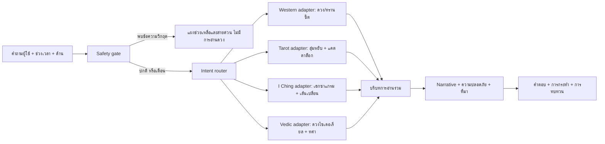
```mermaid
flowchart LR
    Q["คำถามผู้ใช้ + ช่วงเวลา + ด้าน"] --> G["Safety gate"]
    G -->|"พบข้อความวิกฤต"| H["แผงช่วยเหลือและสายด่วน ไม่มีการอ่านดวง"]
    G -->|"ปกติ หรือเตือน"| R["Intent router"]
    R --> W["Western adapter: ดวง/ทรานซิต"]
    R --> T["Tarot adapter: สุ่มหยิบ + แคตตาล็อก"]
    R --> I["I Ching adapter: เฮกซาแกรม + เส้นเปลี่ยน"]
    R --> V["Vedic adapter: ดวงไซเดอเรียล + ทศา"]
    W --> C["บริบทการอ่านร่วม"]
    T --> C
    I --> C
    V --> C
    C --> N["Narrative + ความปลอดภัย + ที่มา"]
    N --> F["คำตอบ + การกระทำ + การทบทวน"]
```

POC มีธีมโหราศาสตร์ตะวันตกรายวันและตามช่วงเวลาแบบสุ่มตัวอย่าง ดวงกำเนิดแบบ tropical การอ่านไพ่ตามคำถาม การโยนเหรียญอี้จิงพร้อมระบุเฮกซาแกรมตามลำดับ King Wen และ API จังหวะเวลาแบบเวทิกทดลอง ส่วนข้อความตัดสินเส้นของอี้จิงตามตำรายังเป็นงานในอนาคต แผนภาพด้านล่างคือเส้นทางคำขอรายวันที่ทำไว้แล้ว (แบบ Western-lite)

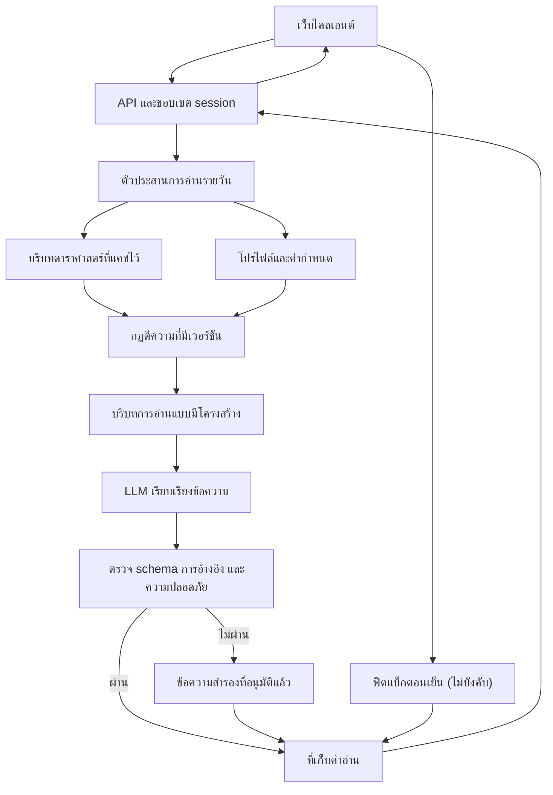
```mermaid
flowchart TD
    U["เว็บไคลเอนต์"] --> API["API และขอบเขต session"]
    API --> O["ตัวประสานการอ่านรายวัน"]
    O --> P["โปรไฟล์และค่ากำหนด"]
    O --> C["บริบทดาราศาสตร์ที่แคชไว้"]
    C --> E["กฎตีความที่มีเวอร์ชัน"]
    P --> E
    E --> R["บริบทการอ่านแบบมีโครงสร้าง"]
    R --> L["LLM เรียบเรียงข้อความ"]
    L --> V["ตรวจ schema การอ้างอิง และความปลอดภัย"]
    V -->|"ผ่าน"| S["ที่เก็บคำอ่าน"]
    V -->|"ไม่ผ่าน"| F["ข้อความสำรองที่อนุมัติแล้ว"]
    F --> S
    S --> API
    API --> U
    U --> B["ฟีดแบ็กตอนเย็น (ไม่บังคับ)"]
    B --> S
```

1. **การคำนวณดาราศาสตร์:** ใช้ ephemeris และไลบรารีคำนวณที่ล็อกเวอร์ชันและทำงานในเครื่อง [JPL Horizons](https://ssd.jpl.nasa.gov/horizons/manual.html) ใช้ตรวจตำแหน่งอิสระได้ แต่ไม่ได้พิสูจน์โหราศาสตร์ [Skyfield](https://github.com/skyfielders/python-skyfield) เป็นตัวเลือกสำหรับ POC ที่ใช้ [สัญญาอนุญาต MIT](https://github.com/skyfielders/python-skyfield/blob/master/LICENSE) ต้องตรวจระบบพิกัด ช่วงข้อมูล kernel และสิทธิ์ของไฟล์ข้อมูลก่อนพัฒนา (POC ในรีโปใช้ `astronomy-engine@2.1.19`)
2. **การตีความ:** กฎที่บันทึกไว้และมีเวอร์ชันแปลงตำแหน่งและความแม่นของโปรไฟล์เป็นธีม รหัสสัญญาณที่รองรับ และประเภทการกระทำที่อนุญาต ความหมายเป็นกฎของผลิตภัณฑ์ ไม่ใช่ข้อเท็จจริงทางวิทยาศาสตร์
3. **LLM:** รับเฉพาะบริบทที่ตรวจแล้ว ภาษา และโทน คืน `signal`, `reading`, `why`, `action` และ `reflection_prompt` เพิ่มตำแหน่งดาว ผลของกฎ หรือข้อกล่าวอ้างส่วนบุคคลที่ไม่มีหลักฐานไม่ได้
4. **ตัวตรวจ (Validator):** ตรวจ schema ความยาว การอ้างอิงแหล่งที่มา/กฎ และเนื้อหาที่ฟันธงเรื่องเสี่ยงสูงหรืออัปมงคล ลองใหม่ได้หนึ่งครั้ง จากนั้นใช้ข้อความสำรองที่เตรียมไว้ ร่างที่ไม่ปลอดภัยไม่ถูกแสดง
5. **ความสม่ำเสมอ:** คำอ่านรายวันไม่ซ้ำตาม `(subject_id, local_date, methodology_version)` ใช้ผลสำเร็จครั้งแรกซ้ำ การเปลี่ยนเขตเวลามีผลวันถัดไป เก็บเวอร์ชันของตัวคำนวณ กฎ prompt และโมเดล

POC ปัจจุบันเป็นเว็บเซอร์วิสเดียวและที่เก็บในเบราว์เซอร์ ผลิตแบบตามคำขอ ผลิตภัณฑ์จริงที่มีบัญชีเพิ่มฐานข้อมูลเชิงสัมพันธ์ บริบทที่คำนวณไว้ล่วงหน้าร่วมกัน งานตามเวลา และการแจ้งเตือนที่ผู้ใช้เลือกเปิด ตามปริมาณการใช้ หากข้อมูลดาราศาสตร์ใช้ไม่ได้ ให้ใช้บริบทที่แคชและตรวจแล้ว หรือล้มเหลวอย่างสุภาพ ห้ามแต่งตำแหน่งดาว หาก LLM ล้มเหลว ใช้ข้อความคงที่ที่อนุมัติแล้ว การแจ้งเตือนล้มเหลวไม่ลบคำอ่าน บันทึกล็อกเป็นรหัส เวอร์ชัน เวลาตอบ และข้อผิดพลาด โดยไม่รวมข้อความทบทวน

## 4.4 ข้อมูลผู้ใช้และ ER Diagram

**เก็บ เฉพาะผู้ใช้ที่ลงทะเบียนและเลือกการปรับแต่ง/ประวัติ** ผู้ใช้ guest ได้คำอ่านทั่วไปที่ไม่ผูกกับบัญชี ข้อความคำถามและบันทึกทบทวนเป็นตัวเลือกและเป็นส่วนตัวโดยปริยาย วันเกิดแบบละเอียด เวลา และสถานที่ จะเก็บเฉพาะฟีเจอร์ดวงกำเนิดเต็มรูปแบบ POC ไม่บันทึกข้อมูลเหล่านี้ ความเชื่อ/ศาสนาไม่ถูกอนุมานหรือบันทึกโดยปริยาย

| ข้อมูล | จุดประสงค์ | ความจำเป็นและความอ่อนไหว |
|---|---|---|
| รหัสบัญชี การอ้างอิงผู้ให้บริการล็อกอิน | เข้าสู่ระบบและซิงก์ | เฉพาะผู้ลงทะเบียน ข้อมูลส่วนบุคคล |
| วันเกิด หรือราศีอาทิตย์ที่คำนวณได้ | ตีความตามราศีอาทิตย์โดยประมาณ | ไม่บังคับ เก็บเฉพาะราศีถ้าไม่ต้องใช้วันเกิดแล้ว |
| เขตเวลา ภาษา | แสดงวันท้องถิ่นและภาษาให้ถูก | เขตเวลาจำเป็น ภาษาใช้ค่าเริ่มต้นได้ |
| ความยินยอม/เวลาแจ้งเตือน | การแจ้งเตือน | เฉพาะ production และต้องเลือกเปิดเอง |
| วันที่ รหัสแหล่งข้อมูล/กฎ เนื้อหา และเวอร์ชัน | ผลคงที่ ประวัติ และการตรวจสอบย้อนหลัง | เฉพาะผู้ลงทะเบียน ข้อมูลส่วนบุคคล |
| คะแนนและบันทึก | การทบทวนและการประเมิน | ไม่บังคับ บันทึกอาจอ่อนไหว |
| ศาสตร์ ช่วงเวลา ด้าน รหัสกฎ/แหล่งที่เลือก | กำหนดเส้นทางและทำซ้ำคำอ่านได้ | ต่อหนึ่งคำอ่าน ความอ่อนไหวต่ำถึงเป็นข้อมูลส่วนบุคคล |
| ข้อความคำถาม (ถ้ายินยอม) ไพ่ที่หยิบ/เฮกซาแกรม | ตอบและเปิดดูซ้ำคำถามที่ยินยอมเก็บ | ข้อความอ่อนไหว มีโหมดชั่วคราวและการลบ |
| เวลาและสถานที่เกิดแบบละเอียด (ถ้าเปิดดวงเต็ม) | คำนวณดวง เรือน และเขตเวลาให้ถูก | ไม่บังคับ อ่อนไหว เก็บเฉพาะโหมดนั้น |

ไม่เก็บรายชื่อผู้ติดต่อ GPS แบบเรียลไทม์ ข้อมูลสุขภาพ การเงิน หรือข้อความส่วนตัว จำกัดสิทธิ์เข้าถึง เข้ารหัสข้อมูลอ่อนไหว ให้ลบคำอ่าน/บันทึก/บัญชีได้ และกำหนดระยะเก็บกับผู้รับผิดชอบด้านผลิตภัณฑ์และความเป็นส่วนตัวก่อนเปิดตัว **เอกสารนี้ไม่ได้รับรองว่าสอดคล้องกฎหมาย (เช่น PDPA) จากการออกแบบเพียงอย่างเดียว**

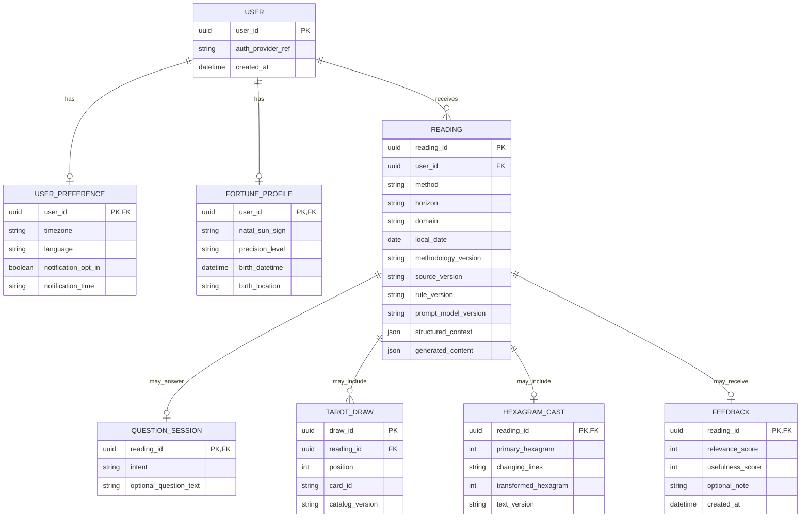
```mermaid
erDiagram
    USER ||--o| USER_PREFERENCE : has
    USER ||--o| FORTUNE_PROFILE : has
    USER ||--o{ READING : receives
    READING ||--o| QUESTION_SESSION : may_answer
    READING ||--o{ TAROT_DRAW : may_include
    READING ||--o| HEXAGRAM_CAST : may_include
    READING ||--o| FEEDBACK : may_receive
    USER {
      uuid user_id PK
      string auth_provider_ref
      datetime created_at
    }
    USER_PREFERENCE {
      uuid user_id PK, FK
      string timezone
      string language
      boolean notification_opt_in
      string notification_time
    }
    FORTUNE_PROFILE {
      uuid user_id PK, FK
      string natal_sun_sign
      string precision_level
      datetime birth_datetime
      string birth_location
    }
    READING {
      uuid reading_id PK
      uuid user_id FK
      string method
      string horizon
      string domain
      date local_date
      string methodology_version
      string source_version
      string rule_version
      string prompt_model_version
      json structured_context
      json generated_content
    }
    QUESTION_SESSION {
      uuid reading_id PK, FK
      string intent
      string optional_question_text
    }
    TAROT_DRAW {
      uuid draw_id PK
      uuid reading_id FK
      int position
      string card_id
      string catalog_version
    }
    HEXAGRAM_CAST {
      uuid reading_id PK, FK
      int primary_hexagram
      string changing_lines
      int transformed_hexagram
      string text_version
    }
    FEEDBACK {
      uuid reading_id PK, FK
      int relevance_score
      int usefulness_score
      string optional_note
      datetime created_at
    }
```

โปรไฟล์ที่ลงทะเบียนเป็นตัวเลือก เพราะไพ่และอี้จิงไม่ต้องใช้ข้อมูลเกิด หนึ่ง `READING` มีหนึ่งศาสตร์/ช่วงเวลา/ด้าน และมีเฉพาะผลของศาสตร์ที่ใช้ `FEEDBACK` มี 0..1 ต่อหนึ่งคำอ่าน คำอ่านรายวันไม่ซ้ำต่อผู้ใช้/วันท้องถิ่น/เวอร์ชันวิธี ส่วนคำอ่านจากคำถามถามซ้ำได้ คำตอบของ guest เป็นข้อมูลชั่วคราวและไม่อยู่ใน ER นี้ แคตตาล็อกของแต่ละศาสตร์เป็นค่ากำหนดของแอป ไม่ใช่ข้อมูลผู้ใช้

## 4.5 ตัวชี้วัด (KPIs)

**North star:** จำนวนผู้ใช้ Compass ที่กลับมาอ่านรายสัปดาห์ = ผู้ใช้ที่อ่านจบอย่างน้อยหนึ่งครั้งในสัปดาห์นี้และอีกครั้งในสัปดาห์ถัดไป แยกนับ session ของ guest เพราะไม่รู้ตัวตนข้ามอุปกรณ์ ห้ามปรับระบบให้เน้นการสร้างความกลัวหรือเวลาที่ใช้

| มิติ | ตัวชี้วัดที่เสนอ |
|---|---|
| Activation | อัตราอ่านครั้งแรกจบ เวลาจนแสดงการ์ด |
| Retention | การกลับมา D1/D7/D30 ตามกลุ่มผู้ใช้ครั้งแรก แยก guest/ผู้ลงทะเบียน |
| Engagement | อ่านจบ การเปิด "ทำไม" การบันทึกการกระทำ การทบทวนตอนเย็น |
| คุณค่าต่อผู้ใช้ | การกระจายคะแนนความตรงประเด็น/ประโยชน์ และอัตราตอบ เพื่อดูอคติจากการเลือกตอบ |
| คุณภาพ AI | ความถูกต้องของโครงสร้างผลลัพธ์ สัดส่วนข้อความที่มีสัญญาณรองรับ อัตราข้อกล่าวอ้างที่ไม่มีหลักฐานจากการสุ่มตรวจ อัตราใช้ข้อความสำรอง |
| ความปลอดภัย | อัตราละเมิดกฎเรื่องเสี่ยงสูงบนชุดทดสอบคงที่ จำนวนที่ถูกบล็อก รายงานจากผู้ใช้ |
| ความเสถียร | อัตราอ่านสำเร็จ ข้อผิดพลาด API เวลาตอบ P50/P95 ความล้มเหลวของงานตามเวลา/การแจ้งเตือน |
| ต้นทุน | ต้นทุน AI ต่อการอ่านที่จบ ต้นทุนคำนวณต่อผู้ใช้ที่ใช้งาน อัตราโดนแคช |

**ไม่ได้อ้างฐานตัวเลข เป้าหมาย หรือผลที่ดีขึ้นใด ๆ** ใช้ความปลอดภัยและความเสถียรเป็นเกณฑ์ปล่อยใช้งาน เก็บ baseline จากการทดลองใช้ก่อนตั้งเป้า คำว่า "เป็นจริง" เป็นความรู้สึกของผู้ใช้ ไม่ใช่ความแม่นยำทางวิทยาศาสตร์

แยกตัวชี้วัดข้างต้นตามศาสตร์ ช่วงเวลา และด้าน และเพิ่ม **อัตราคำถามที่ได้คำตอบจบ** **คะแนน "ตอบตรงคำถาม"** **อัตราหยิบไพ่จบ** และ **อัตราผู้ใช้เปลี่ยนศาสตร์เอง** เพื่อดูว่าตัวจัดเส้นทางมีประโยชน์ไหม ห้ามนำคะแนนโหวตที่เป็นความรู้สึกไปตีเป็น "ความแม่นยำของคำทำนาย" ราวกับรู้ผลจริงแล้ว

## POC และ production

[POC ที่ทำงานได้](poc/README.md) แสดงการสร้างธีมรายวัน/ตามช่วงเวลา API ถามดวงแบบไม่เก็บสถานะ การหยิบไพ่จากแคตตาล็อก 78 ใบ ตำแหน่งดาว/ลัคนา/เรือนแบบ Whole Sign/มุมสำคัญของดวงกำเนิดแบบ tropical การโยนเหรียญอี้จิงพร้อมระบุเฮกซาแกรม และ API จังหวะเวลาเวทิกแบบทดลอง เว็บแบบ responsive มี 7 หน้า ได้แก่ วันนี้ ถามดวง ไพ่ทาโรต์ (เลือกไพ่ 3 ใบจากพัดแล้วกดทำนาย) ดวงกำเนิด สีมงคลและแก้เคล็ด ศาสตร์ไหนแม่น และเครียด โดยมีหน้าแรกแบบเล่าเรื่องตามการเลื่อนเชื่อมถึงกัน อี้จิงและเวทิกใช้ผ่าน API ไม่ได้เป็นหน้า ใช้ `astronomy-engine@2.1.19` คำนวณแหล่งข้อมูลในเครื่อง ตัวเลือก OpenAI structured output เรียบเรียงเฉพาะคำอ่านรายวันเดิม การเรียกจริงยังไม่ได้ตรวจเพราะไม่มี API key ข้อความคำถามไพ่ไม่ถูกบันทึกหรือส่งคืนใน API ไม่มีที่เก็บข้อมูลผู้ใช้ฝั่งเซิร์ฟเวอร์ Playwright แคปหน้าจอเดสก์ท็อปและตรวจเลย์เอาต์มือถือ งานที่เหลือคือเทียบดวงกำเนิดกับตัวอย่างอิสระ ให้ผู้เชี่ยวชาญตรวจแนวทางเวทิก ตรวจความหมายไพ่เชิงบรรณาธิการ ข้อความตัดสินเส้นอี้จิง และความครอบคลุมภาษาไทย/อังกฤษเต็มรูปแบบ ส่วน production เพิ่มการยืนยันตัวตน การเข้ารหัสที่เก็บ การลบข้อมูล การเฝ้าระวัง งานตามเวลา เพดานต้นทุน และการปล่อย prompt/กฎแบบควบคุมเวอร์ชัน

**ทำไมต้องใช้ AI?** เพื่อเรียบเรียงข้อความให้ชัดเจนในภาษาและโทนที่เลือก **ทำไมต้องแยกชั้น?** ตำแหน่งดาว ความหมาย และถ้อยคำ มีแหล่งที่มาและรูปแบบความล้มเหลวต่างกัน **"ทำไม" แสดงอะไร?** เฉพาะปัจจัยจากแหล่งข้อมูลและกฎ **อะไรที่ยังพิสูจน์ไม่ได้?** ว่าผู้ใช้ชอบและกลับมาใช้วงจรนี้จริงหรือไม่ ต้องตรวจด้วยการสัมภาษณ์และการทดลองใช้
