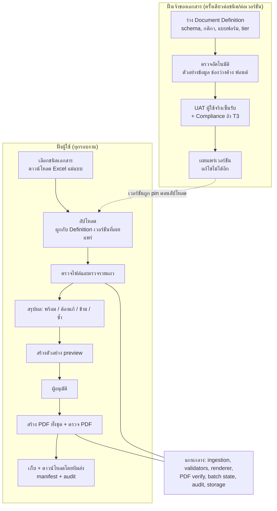
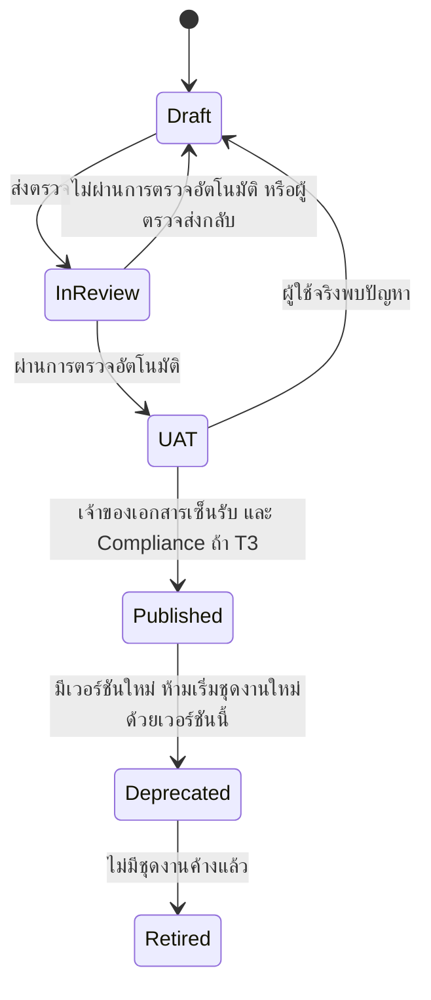
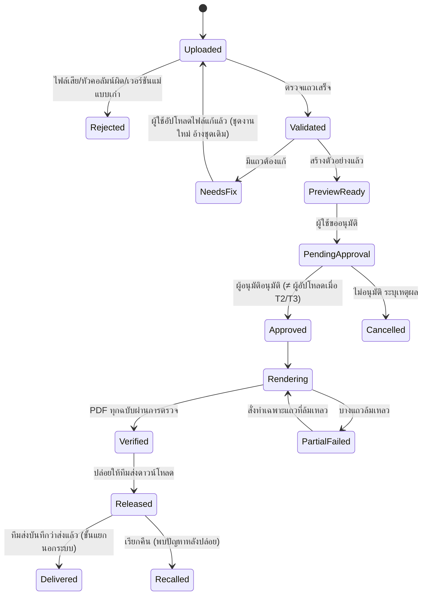
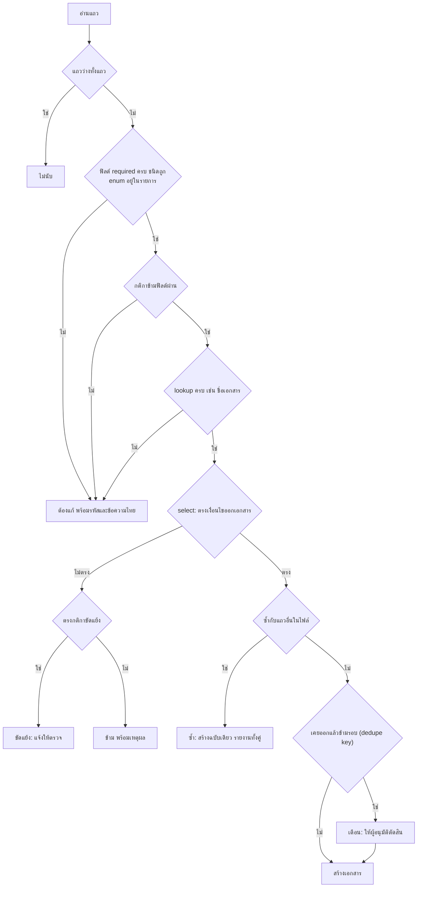

# แพลตฟอร์มกลางสร้าง PDF จาก Excel (Assignment 3) — วิธีคิด การออกแบบ และแผนการทำงาน

> **วันที่เอกสาร:** 2 ตุลาคม 2569 (2026-10-02)
> **ผู้อ่าน:** ทีมเทคนิค, ทีมธุรกิจที่จะใช้ระบบ, ผู้อนุมัติ/ฝ่ายกฎหมาย/DPO, ผู้บริหาร
> **สถานะ:** เอกสารออกแบบ ต่อจาก Assignment 2 ที่ปรับปรุงแล้ว (ดู `A2_CHANGELOG.md`) **ยังไม่ได้สร้างแพลตฟอร์มนี้**
> **คู่มือผู้ใช้ (ข้อ 3.4):** แยกเป็นไฟล์ [USER_GUIDE.md](USER_GUIDE.md) เพื่อแจกให้พนักงานได้โดยตรง

## วิธีอ่านเอกสารนี้

| คุณเป็น | อ่านส่วนไหน |
|---|---|
| ผู้บริหาร / ผู้ตัดสินใจ | 1, 3, 9, 11 |
| ทีมที่จะใช้ระบบ (Claims, Renewal, Underwriting ฯลฯ) | 1, 2, 5, 6, 10, และ USER_GUIDE |
| ผู้อนุมัติ / กฎหมาย / DPO | 1, 2.3, 7, 8, 10 |
| วิศวกร | ทุกส่วน โดยเฉพาะ 4–8 และภาคผนวก ก |

**สัญลักษณ์:** **[ข้อเท็จจริง]** ตรวจจากไฟล์ที่ได้รับ · **[รายงานจาก A2]** ข้อเท็จจริงที่ได้จาก `A2_CHANGELOG.md` ซึ่งผู้เขียนเอกสารนี้ **ยังไม่ได้ตรวจกับโค้ดจริง** (โค้ดอยู่บนเครื่องของเจ้าของงาน) · **[สมมติฐาน]** ข้อเสนอที่ต้องให้เจ้าของธุรกิจยืนยัน · **[Production]** ต้องสร้างเพิ่ม ยังไม่มี · **[ตัวอย่างสมมติ]** ข้อมูลที่ยกมาให้เห็นภาพ ไม่ใช่ข้อมูลหรือกติกาจริงของทีมใด

---

## 1. สรุปสำหรับผู้บริหาร

**คำตอบข้อ 3.1:** **ทำได้ แต่ต้องนิยาม "ยืดหยุ่น" ให้ถูก** ระบบ A2 ทำงานกับเอกสารชนิดเดียว (จดหมายขอเอกสารเพิ่มเติม) แกนของมัน (รับไฟล์ → ตรวจ → คัดแถว → ประกอบเอกสาร → ตรวจ PDF → ให้คนอนุมัติ → เก็บบันทึก) ใช้ซ้ำได้ สิ่งที่ต้องเปลี่ยนคือ **แยก "สิ่งที่ต่างกันของแต่ละเอกสาร" ออกมาเป็นการตั้งค่าที่มีเวอร์ชัน** เรียกว่า **Document Definition** (คำนิยามเอกสาร): คอลัมน์ที่ต้องมี, กติกาตรวจ, เงื่อนไขว่าแถวไหนต้องออกเอกสาร, แบบฟอร์ม, และระดับการอนุมัติ

**"Free-style" ในเอกสารนี้หมายถึง:** หลายแบบฟอร์ม หลายรูปแบบข้อมูล ตั้งค่าได้โดยไม่ต้องแก้โค้ดแกน **ไม่ได้หมายถึง:** รับ Excel หน้าตาอะไรก็ได้ แล้วให้ระบบเดาเอง หรือให้ AI เขียนถ้อยคำจดหมายลูกค้าใหม่ทุกครั้ง

**แนวทางที่เลือกในประโยคเดียว:** แพลตฟอร์มแบบ **config-driven และมีธรรมาภิบาล** (ตั้งค่าได้ มีเวอร์ชัน มีผู้อนุมัติ) ที่ใช้แกนเดียวกันทุกทีม เอกสารแต่ละชนิดมีระดับความเสี่ยงของตัวเอง และมีมาตรการตามระดับนั้น

**ข้อเสนอเชิงตัดสินใจ:** อย่าสร้างแพลตฟอร์มเต็มรูปแบบทันที ให้ทำ **Pilot กับ 2 ทีมที่ต่างกันจริง** ก่อน และวัดว่าเพิ่มเอกสารชนิดใหม่แล้ว **ไม่ต้องแก้แกน** จริงหรือไม่ (เกณฑ์ผ่านอยู่ในส่วน 9) ถ้าไม่มีทีมที่ทำงานซ้ำหลายรอบ ทางเลือกที่ถูกกว่า เช่น mail merge ใน Word/Google Docs อาจเหมาะกว่า (ดูส่วน 3.4)

**สิ่งที่เอกสารนี้ไม่อ้าง:** ไม่อ้างว่ามีตัวเลขประหยัดเวลา/ต้นทุน (ยังไม่เคยวัด) ไม่อ้างว่า "ผ่าน PDPA" ไม่อ้างว่ากติกาธุรกิจของ Warning / Renewal / Pre-existing ถูกต้อง (ไม่เคยเห็นแบบฟอร์มหรือข้อมูลจริงของทีมเหล่านั้น)

---

## 2. ข้อเท็จจริงและข้อจำกัดของสิ่งที่มีอยู่

### 2.1 สิ่งที่โจทย์ให้ [ข้อเท็จจริง]

โจทย์ข้อ 3: ระบบจากข้อ 2 ใช้งานสำเร็จมา 3 เดือน หลายทีมอยากใช้ แต่แต่ละทีมมี template, ข้อมูล และข้อกำหนดทางธุรกิจต่างกัน ตัวอย่างเอกสาร: Warning letters, Renewal notices, Pre-existing condition confirmations, เอกสารลูกค้า/ธุรกิจอื่น ๆ คำถาม 3.1 ทำได้หรือไม่ · 3.2 ออกแบบอย่างไร · 3.3 ข้อดีข้อเสีย · 3.4 เขียนคู่มือสำหรับพนักงานไม่ใช่สายเทคนิคอายุราว 35–40 ที่คุ้นเคย Microsoft Office, Google Workspace และอีเมล

### 2.2 ข้อมูลตัวอย่างของ A2 [ข้อเท็จจริง — ตรวจไฟล์ `Example claim table.xlsx` แล้ว]

- ชีต `Sheet1` มี 7 คอลัมน์: `customer_name`, `policy_number`, `coverage_start_date`, `coverage_end_date`, `hospital_name`, `claim_status`, `document_request`
- ชีตจัดรูปแบบเผื่อไว้ถึงแถว 220 และ 26 คอลัมน์ แต่ **มีข้อมูลจริง 10 แถว** (แถว 2–11) → เป็นเหตุผลที่ระบบต้องนับเฉพาะแถวที่มีข้อมูล
- วันที่ในไฟล์เป็นชนิดวันที่จริง (datetime) ไม่ใช่ข้อความ
- `document_request` เป็นข้อความที่เป็น JSON list เช่น `["Medical Report","สำเนาใบเสร็จค่ารักษาพยาบาล"]` — **ผู้ใช้สายธุรกิจพิมพ์รูปแบบนี้เองมีโอกาสผิดสูง** (ใส่เครื่องหมายคำพูดผิด ลืมวงเล็บ) จึงมีผลต่อการออกแบบ Excel แม่แบบ (ส่วน 5.4)
- ไม่มีรหัสเคลม/รหัสคำขอ (claim/request ID) ในไฟล์

### 2.3 สิ่งที่ A2 ทำแล้ว [รายงานจาก A2 — ยังไม่ได้ตรวจกับโค้ด]

ตาม `A2_CHANGELOG.md` (2 ต.ค. 2569): 133 test ผ่านใน venv สะอาด, `ruff` ผ่าน, ไฟล์ตัวอย่าง 10 แถว → จดหมาย 5 ฉบับ ข้าม 5 กระทบยอดผ่าน ความสามารถที่แกนมีแล้ว:

| ความสามารถ | รายละเอียดตามที่รายงาน |
|---|---|
| ตรวจแถว | รหัสข้อผิดพลาดต่อแถว (เช่น `DATE_ORDER`, `UNKNOWN_DOCUMENT`, `CONFLICTING_ROW`) พร้อมข้อความไทย |
| วันที่ | อ่านหลายรูปแบบ (วันที่จริง, ISO, dd/mm/yyyy, เลข serial) แสดงเป็น พ.ศ. |
| ตารางชื่อเอกสาร | `config/document_names.yml` ชื่อไม่รู้จัก = กันทั้งแถว ห้ามพิมพ์อังกฤษดิบ |
| แถวซ้ำ | แถวเหมือนกัน → สร้างฉบับเดียว รายงานทั้งสองแถว |
| รันซ้ำ | โฟลเดอร์ใหม่ `run_<เวลา>_<แฮช 8>` ไม่เขียนทับ |
| ตรวจ PDF | เทียบ "บรรทัดที่ควรเป็น" ตรวจข้อความซ้ำ ตัวค้าง ฟอนต์ที่ฝัง |
| การเรนเดอร์ | HTML + Chrome headless ฟอนต์ Sarabun แพ็กมา (OFL 1.1) โหมด `--preview` มีแบนเนอร์กันส่ง |
| ตัวดึงข้อความ | PyMuPDF (ไลเซนส์ AGPL — ยังรอฝ่ายที่เกี่ยวข้องพิจารณา) |

**ที่ A2 ยังไม่มี (ตามที่ changelog ระบุ):** audit log, ระบบอนุมัติ, การควบคุมสิทธิ์, ทะเบียนแบบฟอร์ม, หน้าอัปโหลด, ตรวจแถวซ้ำข้ามรอบ → ทั้งหมดนี้คือ **งานหลักของ A3**

**ที่ A2 ยังไม่ได้ทดสอบ (ตามที่ changelog ระบุ):** Linux และ Python เวอร์ชันอื่น, ไฟล์ใหญ่, `.xls`/`.csv`, Excel ระบบวันที่ 1904, ไม่มีภาพอ้างอิงอัตโนมัติ (golden image) สำหรับตำแหน่งวรรณยุกต์ → ต้องแก้ก่อนทำเป็นแพลตฟอร์ม เพราะแพลตฟอร์มจะรันบนเซิร์ฟเวอร์ ไม่ใช่ macOS ของคนเดียว

### 2.4 ข้อจำกัดที่ต้องบอกตรง ๆ

1. ผม (ผู้เขียนเอกสารนี้) **ไม่เคยเห็นแบบฟอร์ม ข้อมูล หรือกติกาของ Warning / Renewal / Pre-existing** ตัวอย่างเอกสารเหล่านี้ในส่วน 4 และภาคผนวก ก เป็น **[ตัวอย่างสมมติ]** เพื่อแสดงว่า Definition หน้าตาเป็นอย่างไร ห้ามนำไปใช้เป็นกติกาจริง
2. ถ้อยคำและเงื่อนไขของเอกสารที่มีผลทางกฎหมาย/กำกับดูแล (ต่ออายุ, ภาวะที่มีมาก่อน) ต้องมาจากฝ่ายกฎหมาย/Compliance ไม่ใช่จากวิศวกร
3. จำนวนแถวต่อรอบ, ความถี่, SLA ของแต่ละทีม **ไม่ทราบ** → ไม่ออกแบบเกินความจำเป็นก่อนรู้ตัวเลข

---

## 3. วิธีคิด

### 3.1 สี่คำถามก่อนออกแบบ

1. **อะไรต่างกันจริงระหว่างทีม และอะไรเหมือนกัน?** ที่เหมือน: รับไฟล์, ตรวจ, ประกอบ, ตรวจ PDF, อนุมัติ, เก็บหลักฐาน ที่ต่าง: คอลัมน์, กติกา, แบบฟอร์ม, ความเสี่ยง, ผู้อนุมัติ
2. **ใครรับผลถ้าผิด และหนักแค่ไหน?** จดหมายเตือนผิดคน ≠ ใบยืนยันผิดวันที่ ≠ หนังสือต่ออายุผิดเบี้ย → ระดับการควบคุมต้องต่างกัน
3. **ส่วนไหนควรเป็นตั้งค่า ส่วนไหนควรเป็นโค้ด?** ตั้งค่าได้: ชื่อคอลัมน์, ชนิดข้อมูล, ค่าที่อนุญาต, เงื่อนไขง่าย ๆ, ข้อความแบบฟอร์ม โค้ด: ตรรกะธุรกิจที่ซับซ้อน การคำนวณ
4. **เมื่อเดือนหน้ามีคนถามว่าทำไมลูกค้าคนนี้ได้เอกสารนี้ ตอบได้ไหม?** ทุกเอกสารต้องย้อนไปถึง: ไฟล์ต้นทาง + แถว + เวอร์ชัน Definition + ผู้อนุมัติ

### 3.2 หลักการ 8 ข้อ (สืบจาก A2 และเพิ่มสำหรับหลายทีม)

| หลักการ | ความหมาย | ที่มา |
|---|---|---|
| ผลต้องเหมือนเดิมทุกครั้ง (deterministic) | ข้อมูลเดิม + Definition เวอร์ชันเดิม = PDF เหมือนเดิม | A2 |
| ไม่ใช้ AI เขียนถ้อยคำลูกค้าตอนรัน | ถ้อยคำมาจากแบบฟอร์มที่อนุมัติแล้วเท่านั้น | A2 |
| Fail before generate | จับข้อผิดพลาดให้มากที่สุด **ก่อน** สร้างเอกสาร | A2 |
| หยุดเมื่อไม่แน่ใจ (fail closed) | ไม่เดา ไม่แก้ข้อมูลเอง | A2 |
| คนอนุมัติก่อนปล่อย, แยก "สร้าง" ออกจาก "ส่ง" | | A2 |
| **ความยืดหยุ่นมีขอบเขต** | ตั้งค่าได้เฉพาะสิ่งที่แพลตฟอร์มรองรับ ของที่เกินต้องผ่านวิศวกร | A3 |
| **ระดับควบคุมตามความเสี่ยงของเอกสาร** | เอกสารเสี่ยงสูงต้องผ่านด่านมากกว่า | A3 |
| **แยกข้อมูลตามทีมโดยค่าเริ่มต้น** | ทีมหนึ่งมองไม่เห็นไฟล์ของอีกทีม | A3 |

### 3.3 บทบาทของ AI (ย้ำ)

- **ตอนรัน:** ไม่มี ไม่ใช้ LLM สร้างข้อความ ไม่ส่งข้อมูลลูกค้าไปบริการภายนอก
- **ตอน onboarding (อนาคต ไม่ใช่ POC):** AI **แนะนำ** การจับคู่หัวคอลัมน์กับช่องในแบบฟอร์มได้ แต่เจ้าของเอกสารต้องตรวจและบันทึกเป็นการตั้งค่าแบบ deterministic ก่อนเผยแพร่ และต้องใช้ข้อมูลตัวอย่างสมมติ ไม่ใช่ข้อมูลลูกค้าจริงในการแนะนำนั้น

---

## 4. การจำแนกเอกสาร (Document Classification)

เอกสารไม่ได้เท่ากัน จึงจำแนกเป็น **ระดับความเสี่ยง (Tier)** เพื่อกำหนดมาตรการ และจำแนก **รูปร่างข้อมูล (Shape)** เพื่อกำหนดว่าตั้งค่าได้เองหรือต้องใช้วิศวกร

### 4.1 ระดับความเสี่ยง [สมมติฐาน — ต้องให้ Compliance/กฎหมายยืนยันการจัดระดับ]

| Tier | ลักษณะ | ตัวอย่างประเภท | มาตรการขั้นต่ำที่เสนอ |
|---|---|---|---|
| **T1 แจ้งข้อมูล** | ไม่ก่อภาระหรือผลสิทธิ์ใหม่ ผิดแล้วแก้ได้ง่าย | หนังสือยืนยันทั่วไป | ตรวจอัตโนมัติ + ผู้อนุมัติ 1 คน (สุ่มตัวอย่างได้) |
| **T2 ก่อภาระ/เกี่ยวข้องข้อมูลอ่อนไหว** | ลูกค้าต้องทำอะไรต่อ หรือมีข้อมูลสุขภาพ | จดหมายขอเอกสารเพิ่มเติม (A2), จดหมายเตือน | T1 + ผู้อนุมัติ ≠ ผู้อัปโหลด + ดูตัวอย่างทุกชุด + ยอดกระทบต้องตรง |
| **T3 มีผลทางกฎหมาย/กำกับดูแล หรือมีตัวเลขเงิน** | ผิดแล้วอาจกระทบสิทธิ์หรือผิดกฎระเบียบ | หนังสือแจ้งต่ออายุ (มีเบี้ย/เงื่อนไข), หนังสือยืนยันภาวะที่มีมาก่อน | T2 + ฝ่ายกฎหมายเซ็นแบบฟอร์มก่อนเผยแพร่ + ตรวจค่าตัวเลขด้วยโค้ดที่ผ่านการทดสอบ + ผู้อนุมัติ 2 คน (ข้อเสนอ) |

> การจัดว่าเอกสารชนิดใดอยู่ Tier ไหนเป็น **สมมติฐาน** ที่ต้องตัดสินโดย Compliance ไม่ใช่วิศวกร

### 4.2 รูปร่างข้อมูล (Shape) ที่แกนต้องรองรับ

| Shape | ลักษณะ | ตัวอย่าง | ตั้งค่าเองได้? |
|---|---|---|---|
| **S1 หนึ่งแถว = หนึ่งเอกสาร ฟิลด์เดี่ยว** | เติมค่าลงช่อง | ใบยืนยัน | ได้ |
| **S2 มีรายการแบบลูป** | ลิสต์ N รายการ | A2: รายการเอกสารที่ขอ | ได้ (มีบล็อกลูปมาตรฐาน) |
| **S3 หลายแถว = หนึ่งเอกสาร** | รวมแถวตามกุญแจ เช่น หลายรายการต่อกรมธรรม์เดียว | หนังสือที่มีตารางรายการ | **ต้องมีตัวรวมแถว (group-by) ที่ผ่านการทดสอบ** ตั้งค่าได้เฉพาะกุญแจรวม |
| **S4 มีตัวเลขเงิน/คำนวณ** | เบี้ย ยอด ส่วนลด | หนังสือต่ออายุ | **ไม่ให้คำนวณในแม่แบบ** ค่าคำนวณมาจากคอลัมน์ที่ระบบต้นทางคำนวณมาแล้ว หรือจากฟังก์ชันที่วิศวกรเขียนและทดสอบ |
| **S5 หลายภาษา/หลายแบบฟอร์มตามเงื่อนไข** | เลือกแบบฟอร์มตามค่าคอลัมน์ | ไทย/อังกฤษ | ได้ผ่านกฎเลือกแบบฟอร์มแบบประกาศ |

### 4.3 สามชั้นของความยืดหยุ่น

| ชั้น | ทำอะไร | ใครทำ | ต้องผ่านอะไร |
|---|---|---|---|
| **A ตั้งค่า** | สร้าง Definition ใหม่จากบล็อกที่แพลตฟอร์มมี | เจ้าของเอกสาร (ทีมธุรกิจ) + วิศวกรช่วย onboarding | ตรวจตัวอย่าง, UAT, อนุมัติ |
| **B แม่แบบใหม่** | ออกแบบหน้าตาจดหมายใหม่ (HTML/CSS ที่ถูกจำกัด) | วิศวกร/นักออกแบบ | ตรวจความปลอดภัยแม่แบบ + ตรวจภาพ |
| **C ตรรกะใหม่** | กติกาซับซ้อน การคำนวณ ตัวรวมแถวใหม่ | วิศวกร | code review + test + (ถ้า T3) Compliance |

ข้อเสนอ: **ไม่สร้างภาษาโปรแกรมย่อยให้ผู้ใช้เขียนเงื่อนไขเอง** เพราะตรวจสอบและทดสอบยาก และเปิดช่องความเสี่ยง — กติกาที่ตั้งค่าได้จำกัดอยู่ที่ validator มาตรฐาน (ไม่ว่าง, รูปแบบ, ช่วงค่า, ค่าที่อนุญาต, เทียบข้ามคอลัมน์ เช่น วันเริ่ม ≤ วันสิ้นสุด) และเงื่อนไขเลือกแถวแบบ `คอลัมน์ = ค่า` / `อยู่ในรายการ`

---

## 5. ภาพรวมระบบ (คำตอบข้อ 3.2)

### 5.1 สถาปัตยกรรมเชิงตรรกะ



> **สถานะ:** แกนกลางที่วงกลมอยู่ใน A2 ในรูป "แกนเดี่ยว" **[รายงานจาก A2]** ชั้น Definition, ทะเบียน, สิทธิ์, อนุมัติ, audit, UI เป็น **[Production]** ยังไม่ได้สร้าง

### 5.2 Document Definition คืออะไร

ไฟล์ตั้งค่า 1 ชุดต่อ 1 ชนิดเอกสาร ต่อ 1 เวอร์ชัน (เก็บเป็นไฟล์ข้อความ เช่น YAML เพื่อเทียบความต่างและย้อนเวอร์ชันได้ — ตัวอย่างเต็มอยู่ภาคผนวก ก) ประกอบด้วย:

| ส่วน | เนื้อหา | ตัวอย่าง |
|---|---|---|
| **identity** | รหัสชนิด, ชื่อ, เจ้าของ, ทีม, Tier, เวอร์ชัน, สถานะ | `claim-doc-request` v1.0.0 T2 |
| **fields** | ชื่อคอลัมน์ (ตรงตัว), ป้ายไทย, ชนิด, จำเป็นไหม, ค่าที่อนุญาต, **เหตุผลที่ต้องเก็บ**, ระดับ PII | `claim_status`: enum |
| **rules** | validator ต่อฟิลด์และข้ามฟิลด์ | `coverage_end_date >= coverage_start_date` |
| **select** | เงื่อนไขว่าแถวไหนออกเอกสาร / ข้าม / ขัดแย้ง | `claim_status = REQUEST_DOC` |
| **dedupe** | คอลัมน์ที่เป็นกุญแจป้องกันซ้ำ (ถ้ามี) | `request_id` |
| **template** | ไฟล์แบบฟอร์ม + เวอร์ชัน + ตัวเลือกวันที่ พ.ศ./ค.ศ. | `request_letter_th.html` |
| **lookups** | ตารางแปลงค่า เช่น ชื่อเอกสารมาตรฐาน | `document_names.yml` |
| **approval** | ใครอนุมัติ กี่คน ต้องสุ่มหรือดูทั้งหมด | T2: 1 คน ≠ ผู้อัปโหลด |
| **output** | รูปแบบชื่อไฟล์ (ไม่มีชื่อ/เลขกรมธรรม์), การรวมไฟล์ | `row_<n>_<hash>.pdf` |
| **retention** | ระยะเก็บต้นฉบับ/PDF/manifest | **ต้องกำหนดโดย DPO ยังไม่มีตัวเลข** |

**ข้อกำหนดข้อสำคัญ:** ทุกฟิลด์ที่ Definition ประกาศต้องมี **เหตุผลการเก็บ (purpose)** ฟิลด์ที่ไม่มีเหตุผลจะผ่านการเผยแพร่ไม่ได้ เป็นการบังคับ data minimisation ที่ตัวระบบ

### 5.3 วงจรชีวิตของ Definition



- **Published แก้ไขไม่ได้** ถ้าจะแก้ถ้อยคำ = ออกเวอร์ชันใหม่ (ตัวอย่าง `1.0.0` → `1.1.0`)
- **ชุดงานที่เริ่มแล้วใช้เวอร์ชันที่ pin ไว้ตอนอัปโหลด** การเผยแพร่เวอร์ชันใหม่ระหว่างชุดงานค้างอยู่ ไม่เปลี่ยนผลของชุดนั้น
- **การตรวจอัตโนมัติก่อนเผยแพร่:** ฟิลด์ทุกตัวที่แม่แบบอ้างมีใน schema · ไม่มีฟิลด์ที่ประกาศแต่ไม่ใช้ · ไม่มีช่องว่างค้าง (`{{`, `<>`) ในข้อความตัวอย่าง · เรนเดอร์ด้วยข้อมูลตัวอย่างสมมติ (รวมกรณีขอบ: ชื่อยาว, ลิสต์ 1 และ 20 รายการ, ข้อมูลมีอักขระ `<`, `&`, อีโมจิ) แล้วผ่านการตรวจ PDF · ฟอนต์ไทยฝังจริง · Excel แม่แบบที่สร้างจาก Definition โหลดกลับเข้าระบบแล้วผ่าน

### 5.4 Excel แม่แบบที่ระบบสร้างให้ (สำคัญสำหรับผู้ใช้สายธุรกิจ)

ระบบสร้างไฟล์ Excel แม่แบบจาก Definition โดยอัตโนมัติ แทนการให้ผู้ใช้เดาหัวคอลัมน์:

- แถวหัวคอลัมน์ล็อก มีแผ่น "วิธีกรอก" และ **เลขเวอร์ชันของ Definition** ฝังไว้ (ถ้าอัปโหลดไฟล์เวอร์ชันเก่า ระบบเตือน)
- คอลัมน์ enum เช่น `claim_status` เป็นรายการให้เลือก (data validation) ลดการพิมพ์ผิด
- คอลัมน์วันที่บังคับรูปแบบวันที่
- **ฟิลด์ลิสต์ (S2): เสนอรูปแบบที่คนกรอกง่าย** เช่น "หนึ่งรายการต่อหนึ่งบรรทัดในเซลล์ (Alt+Enter)" หรือเลือกจากรหัสเอกสาร แล้วให้ระบบแปลงเป็นลิสต์ภายใน ส่วนไฟล์จากระบบต้นทางที่ส่ง JSON มาอยู่แล้ว (เช่นไฟล์ตัวอย่างของ A2) ให้ Definition ระบุ `format: json_list` ได้ → **[สมมติฐาน]** ต้องคุยกับเจ้าของข้อมูลว่าไฟล์จริงมาจากระบบหรือคนพิมพ์
- **ไม่ใช้การจับคู่หัวคอลัมน์แบบเดาตอนรัน** หัวคอลัมน์ต้องตรงตามที่ประกาศ ถ้าทีมมีไฟล์เดิมหน้าตาอื่น ให้เจ้าของเอกสารทำ "การจับคู่คอลัมน์" ตอน onboarding แล้วบันทึกเป็นส่วนหนึ่งของ Definition

### 5.5 วงจรชีวิตของชุดงาน (Batch)



หลักการสำคัญ:

- **อนุมัติหลังเห็นตัวอย่างและรายการยกเว้น** ผู้อนุมัติต้องเห็นทั้งแถวที่สร้าง แถวที่ข้าม แถวที่ผิด แถวซ้ำ และยอดกระทบ
- **การอนุมัติผูกกับ "เนื้อหา" ของชุดงาน** (แฮชของข้อมูลที่ผ่านการตรวจ + เวอร์ชัน Definition) ถ้าข้อมูลเปลี่ยนหลังอนุมัติ ต้องอนุมัติใหม่ ห้าม "อนุมัติไว้ก่อนแล้วค่อยแก้"
- **ไม่แก้ชุดงานเดิมเมื่อแก้ไฟล์** อัปโหลดไฟล์ใหม่ = ชุดงานใหม่ที่อ้างถึงชุดเดิม เพื่อให้ประวัติครบ
- **Released ≠ Delivered:** ระบบไม่ส่งถึงลูกค้าเอง (เหมือน A2) การส่งเป็นกระบวนการแยกที่ทีมส่งบันทึกสถานะ

### 5.6 การป้องกันซ้ำ (Idempotency) ในหลายทีม

| ระดับ | กุญแจ | ทำอะไร | สถานะ |
|---|---|---|---|
| ระดับไฟล์ | `definition_id + definition_version + sha256(ไฟล์)` | อัปโหลดไฟล์เดิมซ้ำ → แสดงชุดงานเดิม ให้เลือก "ใช้ของเดิม / ออกเวอร์ชันใหม่ พร้อมเหตุผล" ไม่สร้างงานส่งซ้ำเงียบ ๆ | [Production] |
| ระดับแถวในไฟล์ | แถวที่ทุกช่องเหมือนกัน | สร้างฉบับเดียว รายงานทั้งสองแถว | [รายงานจาก A2] มีแล้ว |
| ระดับข้ามรอบ | `dedupe key` ที่ Definition ประกาศ (เช่น รหัสคำขอ) | ตรวจกับทะเบียนว่าเคยออกเอกสารชนิดนี้ให้กุญแจนี้แล้วหรือไม่ แสดงเตือนก่อนอนุมัติ | [Production] A2 ยังไม่มี |
| ถ้าไม่มีกุญแจธุรกิจ | – | ทำได้แค่ **เตือน** จากแถวที่เหมือนกันทุกช่อง **รับประกันการไม่ซ้ำเชิงธุรกิจไม่ได้** ต้องขอรหัสคำขอจากระบบต้นทาง | ข้อจำกัดจริง |

ข้อเสนอเสริม: เอกสาร T2/T3 ควรบังคับให้มี dedupe key เมื่อเผยแพร่ (หรือบันทึกการยอมรับความเสี่ยงโดยเจ้าของเอกสาร)

### 5.7 บทบาทและสิทธิ์ [สมมติฐาน — ชื่อบทบาทและจำนวนคนต้องให้องค์กรกำหนด]

| บทบาท | ทำได้ | ทำไม่ได้ |
|---|---|---|
| **Operator** (ผู้เตรียมไฟล์) | ดาวน์โหลดแม่แบบ อัปโหลด ดูผลตรวจ ดู preview ของทีมตัวเอง | อนุมัติชุดงานที่ตัวเองอัปโหลด (T2/T3), เห็นข้อมูลทีมอื่น |
| **Approver** | ดู preview + รายการยกเว้น อนุมัติ/ปฏิเสธ | แก้ข้อมูล |
| **Sender** (ทีมส่ง) | ดาวน์โหลด PDF ที่ Released บันทึกสถานะการส่ง | เห็นชุดที่ยังไม่ Released |
| **Definition Owner** | ร่าง/ส่งตรวจ/เซ็นรับ UAT ของชนิดเอกสารที่เป็นเจ้าของ | เผยแพร่ T3 โดยไม่มี Compliance |
| **Compliance/DPO** | เซ็นแบบฟอร์ม T3 กำหนด retention ดู audit | – |
| **Platform Engineer** | ดูแลระบบ สถานะงาน แก้ระบบ | **เห็นเนื้อหา PII โดยปริยาย** (ต้องใช้สิทธิ์ฉุกเฉินที่ถูกบันทึก) |
| **Auditor** | อ่าน audit log และ manifest | แก้ไขทุกอย่าง |

ทุกบทบาทต้องมีผู้สำรองที่ระบุชื่อ (เหมือน A2: งานไม่หยุดเมื่อมีคนลา)

### 5.8 โครงสร้างข้อมูลหลักของแพลตฟอร์ม [Production — ออกแบบ ยังไม่ได้สร้าง]

| ตาราง | ฟิลด์สำคัญ | เหตุผลที่เก็บ |
|---|---|---|
| `DocumentDefinition` | id, version, tier, status, owner_team, content_hash, published_by/at | ทะเบียนเวอร์ชัน ย้อนดูได้ |
| `Batch` | id, definition_id, definition_version, source_file_hash, uploader_id, state, counts, parent_batch_id | อัตลักษณ์ของรอบงานและกันซ้ำ |
| `BatchRow` | batch_id, row_number, outcome (rendered/skipped/rejected/duplicate/conflict), code, pdf_ref | กระทบยอดและตอบว่า "แถวนี้เกิดอะไร" |
| `Approval` | batch_id, approver_id, decision, reason, content_hash, at | หลักฐานการอนุมัติ |
| `DeliveryRecord` | batch_id, row_number, state, by, at | แยก Released ออกจาก Delivered |
| `AuditEvent` | actor, action, object, at | ใครทำอะไรเมื่อไร (**ไม่เก็บชื่อลูกค้า**) |
| `DedupeLedger` | definition_id, business_key_hash, batch_id, state | กันซ้ำข้ามรอบ (เก็บแฮช ไม่เก็บค่าจริงถ้าเลี่ยงได้) |

manifest ไม่เก็บชื่อลูกค้า/เลขกรมธรรม์ (ใช้เลขแถว + แฮช) ตามที่ A2 ทำ **[รายงานจาก A2]**

### 5.9 สถาปัตยกรรมการติดตั้ง — ขยายตามหลักฐาน ไม่ใช่ตามความคาดเดา

| ระยะ | รูปแบบ | เงื่อนไขขยับ |
|---|---|---|
| POC | เครื่องมือ batch ในเครื่อง รับไฟล์ + Definition (ไฟล์ตั้งค่า) | – |
| Pilot | บริการเดียว + ฐานข้อมูล + ที่เก็บไฟล์ส่วนตัว + UI เรียบง่าย + SSO | มีทีมใช้จริง ≥ 2 ทีม |
| ขยาย | แยก worker เรนเดอร์ + คิวงาน (retry/DLQ) | **เมื่อวัดแล้ว** ว่าเวลาเรนเดอร์ต่อชุดหรือจำนวนชุดพร้อมกันเกินที่ยอมรับ — ตัวเลขนี้ยังไม่ทราบ เพราะยังไม่มีข้อมูลปริมาณจริง |

ทางเลือกคิวงานตั้งแต่แรกเพิ่มความซับซ้อนที่ยังไม่มีเหตุผลรองรับ (A2 มีเพียง 10 แถวในตัวอย่าง)

---

## 6. ตรรกะการตัดสินใจรายแถว — ทำให้เป็นทั่วไป

A2 มีตรรกะ "REQUEST_DOC เท่านั้น" ฝังอยู่ ใน A3 ตรรกะนี้ย้ายเป็นส่วน `select` ของ Definition โดยแกนทำงานเป็นลำดับเดียวกันทุกชนิด:



**การกระทบยอด (ใช้ทุกชนิด):** แถวมีข้อมูล = สร้าง + ข้าม + ต้องแก้ + ขัดแย้ง + ซ้ำ และ สร้าง = สำเร็จ + ล้มเหลว ถ้าไม่ตรง ห้ามขอการอนุมัติ [รายงานจาก A2: มีการกระทบยอดแล้วสำหรับชนิดเดียว]

---

## 7. ระบบพังได้อย่างไร (เพิ่มเติมจาก A2 สำหรับแพลตฟอร์ม)

**หลักคิด:** ความเสี่ยงสูงสุดคือ **"ไม่พัง แต่ผิดเงียบ ๆ"** และในแพลตฟอร์ม ความผิดเงียบ ๆ ใหม่ ๆ มาจาก *การตั้งค่า* ไม่ใช่แค่โค้ด

### 7.1 ความล้มเหลวเฉพาะแพลตฟอร์ม

| # | ความเสี่ยง | ตัวอย่าง | ป้องกัน | ตรวจพบ | รับมือ |
|---|---|---|---|---|---|
| 1 | **Definition ผิดแต่ผ่านการตรวจ** | ตั้งเงื่อนไข select ผิด ทำให้ส่งผิดกลุ่มลูกค้า | UAT กับข้อมูลจริงที่ผู้ใช้ตรวจ, Compliance เซ็น T3, รันคู่ขนานรอบแรก | ผลต่างตอนรันคู่ขนาน, สุ่มตรวจโดยผู้อนุมัติ | Recall ชุดงาน ออกเวอร์ชันใหม่ ประเมินที่ส่งไปแล้ว |
| 2 | **ข้อมูลข้ามทีมรั่ว** | ทีม A เห็น PDF ทีม B | แยกพื้นที่เก็บต่อทีม + ตรวจสิทธิ์ทุกคำขอ (ไม่เชื่อ ID จาก URL) + ทดสอบสิทธิ์อัตโนมัติ | audit log | เพิกถอนสิทธิ์ แจ้ง DPO ตามแผนเหตุการณ์ |
| 3 | **การเปลี่ยนแม่แบบเปลี่ยนงานที่ค้างอยู่** | แก้ถ้อยคำตอนมีชุดรออนุมัติ | Published แก้ไขไม่ได้ ชุดงาน pin เวอร์ชัน | ทดสอบ: เผยแพร่ใหม่ระหว่างชุดค้าง ผลต้องเดิม | – |
| 4 | **Excel แม่แบบเวอร์ชันเก่า** | ผู้ใช้ใช้ไฟล์ที่เก็บไว้เมื่อ 3 เดือนก่อน | ฝังเลขเวอร์ชันในแม่แบบ ตรวจตอนอัปโหลด | ตรวจไฟล์ | ปฏิเสธพร้อมลิงก์แม่แบบใหม่ |
| 5 | **ข้อมูลในเซลล์ใส่สคริปต์/HTML** | ชื่อมี `<script>`, `` | escape ทุกค่าตอนประกอบ ปิดเครือข่ายและการอ่านไฟล์ของตัวเรนเดอร์ แม่แบบเป็นชุดคำสั่งจำกัด ไม่เรียกโค้ด | test ด้วยข้อมูลโจมตีตัวอย่าง | บล็อกแถว ตรวจ log |
| 6 | **ฟอร์มูล่า/คำสั่งใน CSV/Excel ที่ระบบส่งออก** | รายงานแถวผิดมีเซลล์ขึ้นต้น `=` `+` `-` `@` | ทำให้เซลล์ปลอดภัยเมื่อส่งออก | test | – |
| 7 | **ตัวเลขเงินผิด/ปัดเศษ** (T3) | เบี้ย 12,345.675 | ใช้ทศนิยมแบบ decimal ไม่ใช้ float, ไม่คำนวณในแม่แบบ, รูปแบบเงินกำหนดใน Definition, test ค่าขอบ | ตรวจ PDF เทียบค่าต้นทาง | หยุดปล่อย |
| 8 | **ผู้อนุมัติกดผ่านโดยไม่ดู** (approval fatigue) | ชุดงานหลายร้อยฉบับ | บังคับดู preview สุ่ม + รายการยกเว้นก่อนปุ่มอนุมัติเปิด, บันทึกเวลา/สิ่งที่เปิดดู, อนุมัติผูกแฮชเนื้อหา | metrics: เวลาเฉลี่ยก่อนอนุมัติ | ทบทวนกระบวนการ |
| 9 | **คอขวดบริการกลาง** | ทุกทีมต้องการใช้ปลายเดือนพร้อมกัน | แยกงานต่อทีม, ปฏิทินรอบงานที่เห็นร่วมกัน, วัดเวลาก่อนเพิ่มคิว | metrics ความล่าช้าของงาน | ขยายส่วนที่เป็นคอขวดจริง |
| 10 | **เรนเดอร์เปลี่ยนเมื่ออัปเดต Chrome/ฟอนต์** | วรรณยุกต์เพี้ยน | ปักเวอร์ชัน Chrome/ฟอนต์ในอิมเมจ ทดสอบภาพอ้างอิง (golden image) ต่อแม่แบบ | CI | ย้อนเวอร์ชัน |
| 11 | **ความเป็นเจ้าของคลุมเครือ** | แม่แบบไม่มีเจ้าของหลังคนลาออก | บังคับระบุเจ้าของ + ผู้สำรอง ทบทวนประจำปี | รายงาน Definition ไม่มีเจ้าของ | มอบหมายใหม่ หรือ Retire |
| 12 | **การกระจายตัวของการตั้งค่า (config sprawl)** | 40 Definition ที่ไม่มีใครดูแล | จำกัดผู้เผยแพร่ ทบทวนตามรอบ ปิดอัตโนมัติถ้าไม่ใช้นาน (ข้อเสนอ) | รายงานการใช้งาน | Retire |

### 7.2 ความล้มเหลวที่สืบจาก A2 (ยังต้องมีในแพลตฟอร์ม)

ไฟล์เสียหรือหัวคอลัมน์เปลี่ยน, แถวผิด/ซ้ำ, สถานะหรือชื่อเอกสารไม่รู้จัก, ความหมายทางธุรกิจผิด, ช่องว่างค้าง/ฟอนต์/PDF เสีย, ล้มกลางชุด, อัปโหลดหรือส่งซ้ำ, เข้าถึงโดยไม่ได้รับอนุญาต, ตัวตั้งเวลาไม่ทำงาน — มาตรการตามตารางส่วน 8 ของเอกสาร A2 ใช้ต่อได้ แต่ **ต้องย้ายจาก "ตรวจโดยโค้ดชนิดเดียว" เป็น "ตรวจตาม Definition"** และเพิ่ม audit/สิทธิ์ซึ่ง A2 ยังไม่มี

### 7.3 ความเสี่ยงที่ค้างจาก A2 และต้องปิดก่อนยกเป็นแพลตฟอร์ม [รายงานจาก A2 — เป็น "ไม่ได้ตรวจ"]

| ประเด็น | ทำไมมีผลกับแพลตฟอร์ม |
|---|---|
| ยังไม่ทดสอบบน Linux/Python อื่น | แพลตฟอร์มรันบนเซิร์ฟเวอร์ ต้องมี CI บนสภาพแวดล้อมเดียวกับ production |
| ไม่มี golden image | เปลี่ยนฟอนต์/Chrome แล้วเพี้ยนโดยไม่รู้ ยิ่งเสี่ยงเมื่อมีแม่แบบหลายแบบ |
| ไฟล์ใหญ่ `.xls` `.csv` วันที่ 1904 ไม่ได้ทดสอบ | กำหนดและบังคับชนิดไฟล์ที่รับ (แนะนำ `.xlsx` เท่านั้น) และขนาดสูงสุด |
| PyMuPDF เป็น AGPL | ใช้ในบริการที่ผู้อื่นเข้าถึงผ่านเครือข่ายมีผลทางไลเซนส์ ต้องให้ฝ่ายกฎหมาย/ผู้รับผิดชอบตัดสิน หรือเปลี่ยนตัวตรวจ — ผมไม่ได้ตรวจเงื่อนไขไลเซนส์ |
| ไลเซนส์โลโก้/ฟอนต์ ยังไม่ผ่านกฎหมาย | โลโก้แต่ละทีม/แบรนด์ต้องมีสิทธิ์ใช้ |

---

## 8. ข้อมูลส่วนบุคคลและความปลอดภัย (ระดับแพลตฟอร์ม)

เหมือน A2 และเข้มขึ้นเพราะหลายทีม: ข้อมูลที่ผ่านระบบอาจเป็นข้อมูลสุขภาพ (A2) และข้อมูลการเงิน/สัญญา (ต่ออายุ) ห้ามกล่าวว่า "ผ่าน PDPA" จากการออกแบบนี้ ต้องให้ DPO/ฝ่ายกฎหมายประเมิน

| ประเด็น | แนวทาง | สถานะ |
|---|---|---|
| ส่งข้อมูลออกบริการภายนอก | ไม่ส่ง ไม่เรียก AI/API ภายนอกตอนรัน ตัวเรนเดอร์ไม่มีเครือข่ายออก | ออกแบบ |
| การแยกทีม | พื้นที่เก็บ/คิว/สิทธิ์แยกตามทีม ตรวจสิทธิ์ที่ฝั่งเซิร์ฟเวอร์ทุกคำขอ | [Production] |
| Platform engineer | ไม่เห็นเนื้อหา PII โดยปริยาย ใช้ break-glass พร้อมเหตุผลและบันทึก | [Production] |
| การเข้ารหัส | ขณะเก็บและขณะส่ง | [Production] |
| Data minimisation | ฟิลด์ทุกตัวใน Definition ต้องมีเหตุผล ฟิลด์ไม่ใช้ไม่ถูกอ่านเข้าระบบ | ข้อกำหนดของแพลตฟอร์ม |
| Retention | กำหนดต่อ Definition โดย DPO **ยังไม่มีตัวเลข** ลบอัตโนมัติ (ไฟล์ต้นฉบับ ควรสั้นกว่า manifest) | [Production] |
| Log | audit บันทึกการกระทำ ไม่บันทึกชื่อ/เลขกรมธรรม์ ชื่อไฟล์ใช้เลขแถว + แฮช | [รายงานจาก A2] บางส่วน |
| ข้อมูลทดสอบ | สมมติเท่านั้น ห้ามข้อมูลลูกค้าจริงในการพัฒนา/UAT เว้นแต่มีสภาพแวดล้อมและการอนุมัติเฉพาะ | ข้อกำหนด |
| ความปลอดภัยแม่แบบ | แม่แบบเป็นโค้ดที่ถูกจำกัด (ไม่มีการรันโค้ดอิสระ ไม่โหลดทรัพยากรภายนอก) ต้องผ่านการตรวจก่อนเผยแพร่ | [Production] |
| การแจ้งเหตุละเมิด | ใช้แผนรับมือของ A2 ส่วน 8.3 (ร่าง) **ตัวเลขกรอบเวลา/มาตราตามกฎหมายต้องให้ฝ่ายกฎหมายยืนยัน ผมไม่ได้ตรวจกับตัวบท** | ร่าง |

---

## 9. ข้อดี ข้อเสีย และทางเลือก (คำตอบข้อ 3.3)

### 9.1 ทางเลือกที่พิจารณา

| ทางเลือก | อธิบาย | เหมาะเมื่อ |
|---|---|---|
| **A. แยกสคริปต์ต่อทีม** (คัดลอก A2 แล้วแก้) | ง่ายและเร็วในระยะแรก | 1–2 ทีม ไม่ขยายต่อ |
| **B. แพลตฟอร์ม config-driven มีธรรมาภิบาล** *(ที่เลือก)* | แกนเดียว Definition ต่อชนิดเอกสาร | หลายทีมงานซ้ำ ต้องตรวจสอบย้อนหลังได้ |
| **C. ผลิตภัณฑ์สำเร็จรูป / low-code** | ซื้อหรือใช้เครื่องมือสร้างเอกสารที่มีอยู่ | ต้องการเร็ว ยอมรับข้อจำกัดของผู้ขาย (ผมไม่ได้เทียบผลิตภัณฑ์ใดโดยเฉพาะ ไม่มีข้อมูลราคาหรือความสามารถที่ตรวจแล้ว) |
| **D. mail merge ใน Word/Google Docs** | ผู้ใช้ทำเองได้ ไม่ต้องพัฒนา | ปริมาณน้อย ไม่ต้องตรวจเข้ม ไม่มี PII ละเอียดอ่อน |
| **E. ให้ LLM เขียนเอกสารจากข้อมูล** | ยืดหยุ่นสุด | **ไม่แนะนำ** สำหรับเอกสารถึงลูกค้า: ผลไม่เหมือนเดิม ตรวจย้อนยาก อาจเปลี่ยนถ้อยคำ/ใส่ข้อมูลที่ไม่มี ข้อมูลสุขภาพไม่ควรออกนอกโดยไม่จำเป็น |

### 9.2 ข้อดีและข้อเสียของ B

| ข้อดี | ต้นทุน / ความเสี่ยง | วิธีรับมือ |
|---|---|---|
| ตรวจ/เรนเดอร์/อนุมัติ/audit ชุดเดียว ลดโค้ดซ้ำและแก้ครั้งเดียวได้ทุกทีม | **เป็นจุดล้มเหลวร่วม** (single point of failure) ความผิดพลาดกระทบทุกทีม | แยกงานต่อทีม, CI เข้ม, เวอร์ชัน pin, แผนย้อนกลับ |
| เพิ่มเอกสารชนิดใหม่เร็วกว่า (ถ้าเข้ารูปแบบ S1–S2) | **ต้องดูแล "ระบบตั้งค่า" เพิ่มอีกชั้น** เป็นผลิตภัณฑ์ภายในที่ต้องมีเจ้าของ เอกสาร การสนับสนุน | ตั้งทีมเจ้าของแพลตฟอร์ม จำกัดขอบเขตความยืดหยุ่น |
| พื้นฐานตรวจสอบย้อนหลังเหมือนกันหมด | **ความซับซ้อนด้านสิทธิ์ข้ามทีม** ผิดพลาดหนึ่งครั้ง = ข้อมูลรั่วข้ามทีม | default แยกทีม, ทดสอบสิทธิ์อัตโนมัติ |
| ผู้ใช้เรียนรู้ครั้งเดียว ใช้ได้หลายเอกสาร | **ความเรียบง่ายกับความยืดหยุ่นขัดกัน** เอกสารแปลกจะไม่เข้า | บอกตรง ๆ ว่าไม่ได้รองรับทุกอย่าง มีชั้น C ที่ผ่านวิศวกร |
| เอกสารเสี่ยงสูงถูกควบคุมตาม Tier | **ภาระอนุมัติเพิ่ม** ทำให้ช้าลงและเกิด approval fatigue | อนุมัติแบบดู preview + รายการยกเว้น ไม่ต้องอ่านทุกฉบับ เฉพาะ T3 เข้มสุด |
| ผลสม่ำเสมอ ตรวจสอบและทดสอบได้ | **เวลาลงทุนล่วงหน้าสูง** ก่อนเห็นผล | Pilot 2 ทีม วัดก่อนขยาย |
| ไม่ต้องใช้ AI ตอนรัน (ผลคาดการณ์ได้, ข้อมูลไม่ออกนอก) | **ถ้อยคำใหม่ต้องมีคนเขียน/อนุมัติเอง** ไม่ได้ช่วยร่างอัตโนมัติ | อาจใช้ AI ช่วยร่างเฉพาะตอน onboarding โดยใช้ข้อมูลสมมติ (อนาคต) |
| การย้ายแม่แบบเดิมของแต่ละทีมได้ทีละชนิด | **ต้นทุนการย้าย** (legacy template, ข้อมูลต้นทาง) | onboard ทีละทีม ไม่ย้ายพร้อมกัน |

### 9.3 เมื่อไรที่ไม่ควรสร้างแพลตฟอร์ม

- มีทีมเดียวที่ใช้จริงและไม่มีแผนขยาย → ใช้ A (สคริปต์เดียว) ต่อไป
- เอกสารปริมาณน้อย (ไม่กี่ฉบับต่อรอบ) และไม่ละเอียดอ่อน → D (mail merge) ถูกกว่า
- ทีมไม่สามารถกำหนดเจ้าของแบบฟอร์ม/ผู้อนุมัติ → ปัญหาไม่ได้อยู่ที่เครื่องมือ แก้กระบวนการก่อน
- เอกสารแต่ละฉบับต้องผ่านการเขียนเฉพาะรายโดยมนุษย์ (ไม่ใช่การเติมแม่แบบ) → ไม่ใช่งานของระบบนี้

### 9.4 เกณฑ์ตัดสินผล Pilot (ตัวเลขเป้าหมายต้องกำหนดหลังได้ baseline ไม่ใช่ตอนนี้)

| ข้อ | เกณฑ์ผ่านเชิงคุณภาพ | วัดอย่างไร |
|---|---|---|
| ความยืดหยุ่นจริง | เพิ่มชนิดเอกสารที่ 2 และ 3 โดย **ไม่แก้โค้ดแกน** (ชั้น A เท่านั้น) | จำนวน commit ที่แตะแกน = 0 |
| ความถูกต้อง | รันคู่ขนานต่อชนิด: ไม่มีความผิดเพี้ยนที่ไม่ได้อธิบาย | ตารางเทียบทีละฉบับ |
| ความปลอดภัย | ทดสอบสิทธิ์ข้ามทีมผ่านทั้งหมด | test อัตโนมัติ + ตรวจโดยบุคคลที่สาม |
| ใช้งานได้จริง | ผู้ใช้สายธุรกิจทำชุดงานจบเองโดยดูแค่ USER_GUIDE | สังเกตการณ์ผู้ใช้ 3–5 คน (ตัวเลขตัวอย่างสมมติ ไม่ใช่ผลวัด) |
| ต้นทุนดูแล | ทีมแพลตฟอร์มรับ onboarding ชนิดใหม่ในเวลาที่ตกลงกันได้ | บันทึกเวลาจริง |

---

## 10. การทำงานร่วมกับผู้ใช้หลายทีม

### 10.1 ขั้นตอน onboarding ชนิดเอกสารใหม่ (ต่อชนิด)

1. **ค้นหาความต้องการ** (ขอเอกสารที่ต้องใช้ตามส่วน 10.2) แยก Tier ร่วมกับ Compliance
2. **เขียน Definition ฉบับร่าง** จากแบบฟอร์มและข้อมูลตัวอย่างสมมติ (ไม่ใช่ข้อมูลลูกค้าจริง)
3. **ตรวจอัตโนมัติ** + **เจ้าของเอกสารตรวจภาพ** ด้วยข้อมูลสมมติที่รวมกรณีขอบ
4. **รันคู่ขนาน 1 รอบ** กับวิธีปัจจุบัน (ข้อมูลจริงในสภาพแวดล้อมที่ได้รับอนุมัติ) เทียบทุกฉบับ
5. **เซ็นรับ UAT** (+ Compliance ถ้า T3) → เผยแพร่
6. **ใช้งานแบบกำกับ 3 รอบแรก** ทบทวนหลังจบรอบ จากนั้นใช้ issue log

### 10.2 สิ่งที่ต้องขอจากแต่ละทีมเพื่อเติมให้สมจริง (นี่คือคำตอบของ "ต้องการข้อมูลเอกสารตัวอย่างเพื่อเติมหรือไม่")

**ต้องการ** — โดยเฉพาะ 5 สิ่งต่อชนิดเอกสาร:

| # | สิ่งที่ต้องขอ | ทำไม |
|---|---|---|
| 1 | แบบฟอร์มจริง (ต้นฉบับ .docx หรือ PDF) + ถ้อยคำที่อนุมัติแล้ว + ชื่อนิติบุคคล/ผู้ลงนาม/ช่องทางติดต่อ | แกนของ template และ Tier |
| 2 | Excel ตัวอย่าง (ข้อมูลสมมติที่โครงสร้างเหมือนจริง) + ความหมายของทุกคอลัมน์ | สร้าง schema ที่ถูกต้อง |
| 3 | กติกาว่าแถวไหนออกเอกสาร/ข้าม/ถือว่าผิด ตัวอย่างขอบเขต | ส่วน `select`/`rules` |
| 4 | คีย์ไม่ซ้ำของคำขอ (ถ้ามี), ความถี่รอบงาน, ปริมาณต่อรอบ, เวลาตัดรอบ | ป้องกันซ้ำและขนาดระบบ |
| 5 | ผู้เป็นเจ้าของ/ผู้อนุมัติ/ผู้ส่ง + ผู้สำรอง + ช่องทางส่ง + นโยบายเก็บข้อมูล | RACI และ retention |

### 10.3 ใครรับผิดชอบอะไร (RACI ระดับแพลตฟอร์ม) [สมมติฐาน]

| งาน | Operator | Definition Owner | Approver | Sender | Compliance/DPO | Platform Eng |
|---|---|---|---|---|---|---|
| เตรียมและอัปโหลดไฟล์ | **R** | I | – | – | – | – |
| แก้ข้อมูลที่ระบบแจ้ง | **R** | C | – | – | – | C |
| อนุมัติถ้อยคำ/เผยแพร่เวอร์ชัน | C | **R** | – | – | **A** (T3) / C | C |
| อนุมัติปล่อยชุดงาน | I | I | **A/R** | I | – | – |
| ส่งถึงลูกค้า | – | – | I | **R** | – | – |
| แก้ระบบ/แก้การตั้งค่าที่เสีย | I | C | I | I | I | **A/R** |
| ตั้ง retention/นโยบายข้อมูล | – | C | – | – | **A/R** | C |

R = ทำ, A = รับผิดชอบสุดท้าย, C = ปรึกษา, I = รับแจ้ง ทุกบทบาทต้องมีผู้สำรอง

---

## 11. แผนการทำงาน


| เฟส | งานหลัก | เกณฑ์ผ่าน |
|---|---|---|
| **0 ปิดค้างของ A2** | ทดสอบบน Linux + CI ในสภาพแวดล้อมเดียวกับที่จะรันจริง · เพิ่ม golden image ของจดหมายตัวอย่าง · ตัดสินเรื่อง AGPL ของ PyMuPDF · กำหนดชนิดไฟล์ที่รับและขนาดสูงสุด · อัปเดตตัวตรวจความสอดคล้อง A2–A3 (`check_a2_a3.py` ตาม changelog ล้มอยู่) | CI เขียวบน Linux, ไม่มีคำถามไลเซนส์ค้างที่บล็อก |
| **1 ค้นหาความต้องการ** | ขอสิ่งในส่วน 10.2 จาก 2 ทีมที่ต่างกันจริง (เช่น เอกสารมีตัวเลขเงินกับไม่มี) · จัด Tier กับ Compliance | เอกสารข้อตกลง (data contract) ที่เจ้าของเซ็น |
| **2 POC แพลตฟอร์ม** | ย้ายตรรกะ A2 ที่ฝังในโค้ดไปเป็น Definition (A2 ต้องออกผลเหมือนเดิมทุกตัวอักษร = test ถอยหลัง) · เพิ่ม 2 ชนิดเอกสารที่ต่างกัน · ตัวสร้าง Excel แม่แบบ | ผลของ A2 ผ่าน Definition = ผลเดิม (เทียบ PDF/ข้อความ) · เพิ่มชนิดที่ 3 โดยไม่แก้แกน |
| **3 Pilot** | UI + SSO · สิทธิ์ต่อทีม · อนุมัติ · audit · ที่เก็บส่วนตัว · แจ้งเตือน · ทะเบียนซ้ำข้ามรอบ | เกณฑ์ส่วน 9.4 · ผ่านการประเมินความปลอดภัย/PDPA โดยผู้รับผิดชอบ |
| **4 ขยาย** | onboard ทีมถัดไป · เพิ่มคิวงานเมื่อวัดแล้วจำเป็น | ตามหลักฐานจาก Pilot |

ผมไม่ให้ตัวเลขเวลาหรือจำนวนคน เพราะยังไม่ทราบขนาดทีม ปริมาณ และข้อกำหนดองค์กร

---

## 12. คำถามที่ต้องตัดสินใจ

| # | คำถาม | ใครตอบ | ทำไมสำคัญ |
|---|---|---|---|
| 1 | ทีมไหนจะเป็น Pilot ทั้ง 2 และเอกสารที่ต้องการคืออะไรบ้าง | ผู้บริหาร | กำหนดขอบเขตจริง ไม่ใช่เดา |
| 2 | Tier ของแต่ละชนิดเอกสาร และต้องใช้ผู้อนุมัติกี่คน | Compliance/กฎหมาย | ระดับการควบคุม |
| 3 | ต้องมี "เจ้าของแบบฟอร์ม" ชื่อใคร และใครสำรอง | ผู้บริหารทีม | ไม่มีเจ้าของ = เผยแพร่ไม่ได้ |
| 4 | รูปแบบวันที่ (พ.ศ./ค.ศ.) ตามชนิดเอกสาร | เจ้าของแบบฟอร์ม | ลูกค้าอ่านถูก |
| 5 | ระบบต้นทางให้รหัสคำขอ/เคลมที่ไม่ซ้ำได้ไหม ทุกทีมมีหรือไม่ | เจ้าของระบบต้นทาง | กันซ้ำจริง |
| 6 | ถ้ามีแถวผิดบางแถว จะปล่อยส่วนที่ถูกก่อนหรือหยุดทั้งชุด (ต่อชนิด) | Claims + ผู้อนุมัติ | นโยบายชุดงานบางส่วน |
| 7 | ระยะเก็บไฟล์ต้นฉบับ/PDF/manifest และช่องทางส่ง | DPO + ธุรกิจ | PDPA |
| 8 | ปริมาณแถวต่อรอบ ความถี่ ช่วงพีค | แต่ละทีม | ตัดสินว่าต้องมีคิวงานเมื่อไร |
| 9 | ไลเซนส์ PyMuPDF (AGPL) ยอมรับได้ไหมในบริการภายใน | กฎหมาย/ผู้รับผิดชอบ | บล็อกการ deploy ถ้าไม่ผ่าน |
| 10 | โลโก้/แบรนด์ของแต่ละทีมใช้ได้ถูกต้องไหม | เจ้าของแบรนด์ | ไลเซนส์ |
| 11 | เอกสาร S3 (หลายแถว = 1 ฉบับ) มีทีมไหนต้องการจริงไหม | แต่ละทีม | เพิ่มความซับซ้อนมาก ทำเฉพาะเมื่อจำเป็น |
| 12 | ใครคือผู้ได้รับอนุญาตให้เห็น PII ฉุกเฉิน (break-glass) | DPO/Security | สิทธิ์ผู้ดูแลระบบ |

---

## 13. คำศัพท์

| คำ | ความหมายง่าย ๆ |
|---|---|
| **Document Definition** | "ใบสั่งงาน" ของเอกสารหนึ่งชนิด: ต้องมีคอลัมน์อะไร ตรวจอย่างไร ใครอนุมัติ ใช้แบบฟอร์มไหน |
| **เวอร์ชัน (pin)** | ชุดงานจำเวอร์ชันที่ใช้ไว้ แม้ภายหลังมีเวอร์ชันใหม่ ชุดงานเดิมก็ไม่เปลี่ยน |
| **Tier** | ระดับความเสี่ยงของเอกสาร ยิ่งสูงยิ่งมีด่านมาก |
| **Preview** | ตัวอย่างจดหมายที่สร้างก่อนปล่อยจริง |
| **Manifest** | รายงานสรุปชุดงาน: สร้างกี่ฉบับ ข้ามกี่แถว ผิดกี่แถว ใช้เวอร์ชันไหน |
| **Reconciliation (กระทบยอด)** | เช็คว่าตัวเลขรวมตรงกัน ไม่มีแถวหาย |
| **Idempotency** | ทำซ้ำกี่ครั้งก็ไม่ทำให้เกิดการส่งซ้ำ |
| **UAT** | ผู้ใช้จริงลองและยืนยันก่อนใช้งานจริง |
| **Parallel run** | ทำวิธีเดิมกับวิธีใหม่พร้อมกัน แล้วเทียบ |
| **RBAC** | ให้สิทธิ์ตามบทบาท ไม่ใช่ตามตัวบุคคล |
| **Break-glass** | สิทธิ์ฉุกเฉินที่เปิดได้เมื่อจำเป็นและถูกบันทึกทุกครั้ง |
| **Golden image** | ภาพ PDF ที่ตรวจด้วยสายตาแล้วใช้เป็นต้นแบบเทียบอัตโนมัติ |
| **DPO** | เจ้าหน้าที่คุ้มครองข้อมูลส่วนบุคคลขององค์กร |

---

## ภาคผนวก ก — ตัวอย่าง Document Definition [ตัวอย่างสมมติ]

> **คำเตือน:** ตัวอย่างด้านล่างแสดง **โครงสร้าง** ของ Definition เท่านั้น
> - ตัวอย่างที่ 1 (จดหมายขอเอกสาร) อิงจากไฟล์ตัวอย่างและแบบฟอร์มของ A2 จริง แต่ **ถ้อยคำและกติกาธุรกิจยังรอการยืนยัน**
> - ตัวอย่างที่ 2–3 (Warning, Renewal) **คิดขึ้นเองเพื่อสาธิต** ชื่อฟิลด์ เงื่อนไข และ Tier **ไม่ใช่ของจริงจากทีมใด**
> - ไม่ใช้ข้อมูลลูกค้าจริงในที่ใดของเอกสารนี้
> - ไวยากรณ์ YAML ถูกตรวจว่าอ่านได้ (parse) แต่ **ไม่มีโค้ดใดรัน Definition เหล่านี้** เพราะแพลตฟอร์มยังไม่ถูกสร้าง

### ก.1 จดหมายขอเอกสารเพิ่มเติม (ย้ายจาก A2)

```yaml
id: claim-doc-request
version: 1.0.0
owner_team: claims            # สมมติ
tier: T2                      # สมมติ ให้ Compliance ยืนยัน
status: draft
fields:
  - {name: customer_name,        type: text,  required: true,  pii: direct,    purpose: "ระบุผู้รับในจดหมาย"}
  - {name: policy_number,        type: text,  required: true,  pii: direct,    purpose: "อ้างอิงกรมธรรม์ในจดหมาย"}
  - {name: coverage_start_date,  type: date,  required: true,  pii: indirect,  purpose: "แสดงช่วงความคุ้มครองในจดหมาย"}
  - {name: coverage_end_date,    type: date,  required: true,  pii: indirect,  purpose: "แสดงช่วงความคุ้มครองในจดหมาย"}
  - {name: hospital_name,        type: text,  required: true,  pii: sensitive,  purpose: "ระบุโรงพยาบาลที่เกี่ยวข้องกับการเคลม"}
  - {name: claim_status,         type: enum,  required: true,  pii: sensitive,  purpose: "เลือกแถวที่ต้องออกจดหมาย",
     allowed: [REQUEST_DOC, APPROVED, REJECTED]}
  - {name: document_request,     type: list,  required: true,  pii: sensitive,  purpose: "รายการเอกสารที่ขอในจดหมาย",
     format: json_list, lookup: document_names}
rules:
  - {id: DATE_ORDER, expr: "coverage_end_date >= coverage_start_date"}
select:
  generate_when: {claim_status: REQUEST_DOC}
  conflict_when: {claim_status_not: REQUEST_DOC, document_request_not_empty: true}
dedupe:
  key: null                   # ไฟล์ตัวอย่างไม่มีรหัสคำขอ -> ทำได้แค่เตือน (ดูส่วน 5.6)
template: {file: request_letter_th.html, version: "1.0.0", date_style: buddhist}   # date_style รอยืนยัน
approval: {approvers: 1, must_differ_from_uploader: true}
retention: TBD_BY_DPO
```

### ก.2 จดหมายเตือน (Warning letter) [คิดขึ้นสมมติ]

```yaml
id: sample-warning-letter     # ตัวอย่างสมมติ ไม่ใช่ของทีมจริง
version: 0.1.0
tier: T2
status: draft
fields:
  - {name: customer_name,  type: text, required: true, pii: direct,   purpose: "ระบุผู้รับ"}
  - {name: policy_number,  type: text, required: true, pii: direct,   purpose: "อ้างอิงกรมธรรม์"}
  - {name: warning_reason, type: enum, required: true, pii: indirect, purpose: "เลือกถ้อยคำเหตุผลจากคลังที่อนุมัติแล้ว",
     allowed: [REASON_A, REASON_B]}     # ค่าเป็นรหัส ไม่ใช่ข้อความอิสระ
  - {name: due_date,       type: date, required: true, pii: none,     purpose: "วันครบกำหนดดำเนินการในจดหมาย"}
select:
  generate_when: {warning_reason_in: [REASON_A, REASON_B]}
dedupe: {key: [policy_number, warning_reason, due_date]}
lookups: {warning_reason: warning_reasons.yml}   # ถ้อยคำจริงมาจากไฟล์ที่ผ่านการอนุมัติ
template: {file: warning_letter_th.html, version: "0.1.0", date_style: TBD}
approval: {approvers: 1, must_differ_from_uploader: true}
```

> หมายเหตุออกแบบ: ช่องเหตุผลเป็น **รหัสจากรายการปิด** ที่ผูกกับถ้อยคำอนุมัติแล้ว ไม่ใช่ข้อความอิสระ เพื่อไม่ให้ผู้กรอก Excel เป็นคนเขียนถ้อยคำถึงลูกค้า

### ก.3 หนังสือแจ้งต่ออายุ (Renewal notice) [คิดขึ้นสมมติ — มีตัวเลขเงิน → T3]

```yaml
id: sample-renewal-notice     # ตัวอย่างสมมติ ไม่ใช่ของทีมจริง
version: 0.1.0
tier: T3
status: draft
fields:
  - {name: customer_name,    type: text,    required: true, pii: direct,   purpose: "ระบุผู้รับ"}
  - {name: policy_number,    type: text,    required: true, pii: direct,   purpose: "อ้างอิงกรมธรรม์"}
  - {name: renewal_date,     type: date,    required: true, pii: indirect, purpose: "วันที่เริ่มกรมธรรม์ใหม่"}
  - {name: renewal_premium,  type: decimal, required: true, pii: indirect, purpose: "เบี้ยที่แสดงในหนังสือ",
     scale: 2, min: 0, source: "คำนวณมาจากระบบต้นทาง ห้ามคำนวณในแม่แบบ"}
select:
  generate_when: {always: true}
dedupe: {key: [policy_number, renewal_date]}
template: {file: renewal_notice_th.html, version: "0.1.0", date_style: TBD}
approval: {approvers: 2, must_differ_from_uploader: true, legal_signoff_required: true}
```

> สิ่งที่ตัวอย่างนี้ **ไม่ครอบคลุม** และต้องมีจากทีมจริง: ข้อความบังคับตามกฎระเบียบ, ช่วงเวลาแจ้งล่วงหน้า, เงื่อนไขเปลี่ยนเบี้ย, ภาษาของข้อความสำคัญ

### ก.4 สิ่งที่ผมตรวจแล้ว และยังไม่ได้ตรวจ

**ตรวจแล้ว:** ไฟล์ Excel ตัวอย่างมี 7 คอลัมน์ 10 แถวข้อมูล (5 REQUEST_DOC / 3 APPROVED / 2 REJECTED) · ข้อความ/ภาพของโจทย์หน้า 7 และ 9 · แบบฟอร์มตัวอย่างหน้าเดียว · เนื้อหา `A2_CHANGELOG.md`

**ยังไม่ได้ตรวจ:**
- **โค้ด A2 บนเครื่องของเจ้าของงาน** (`.../sunday/as2`) — ทุกข้อความ "[รายงานจาก A2]" ยังไม่ได้เทียบกับโค้ดและผลทดสอบจริง
- Definition ในภาคผนวก ก ยังไม่เคยถูกรันกับตัวประมวลผลใด
- ไดอะแกรม Mermaid ยังไม่ได้เรนเดอร์ดูภาพ (เขียนตามไวยากรณ์ปกติ)
- เงื่อนไขไลเซนส์ PyMuPDF/ฟอนต์/โลโก้
- ถ้อยคำ กติกา และ Tier ของเอกสารทุกชนิดนอกจดหมายขอเอกสาร
- ข้อกำหนดทางกฎหมาย PDPA และกฎระเบียบประกันภัยที่เกี่ยวข้อง
- ปริมาณงาน ประสิทธิภาพ ต้นทุน ระยะเวลา และตัวเลขใด ๆ ของแผนงาน
